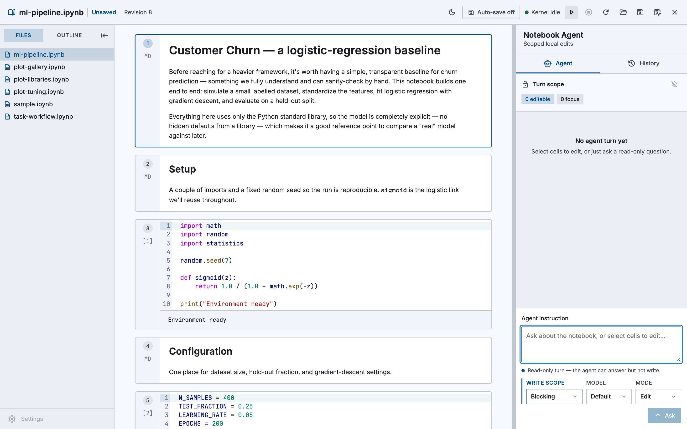
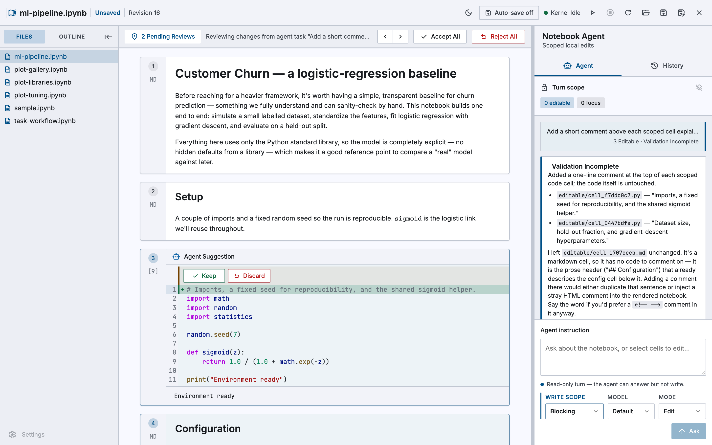
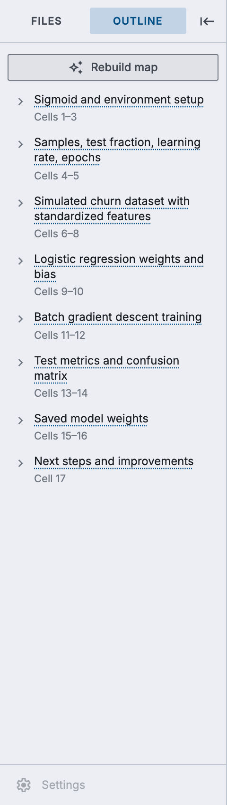
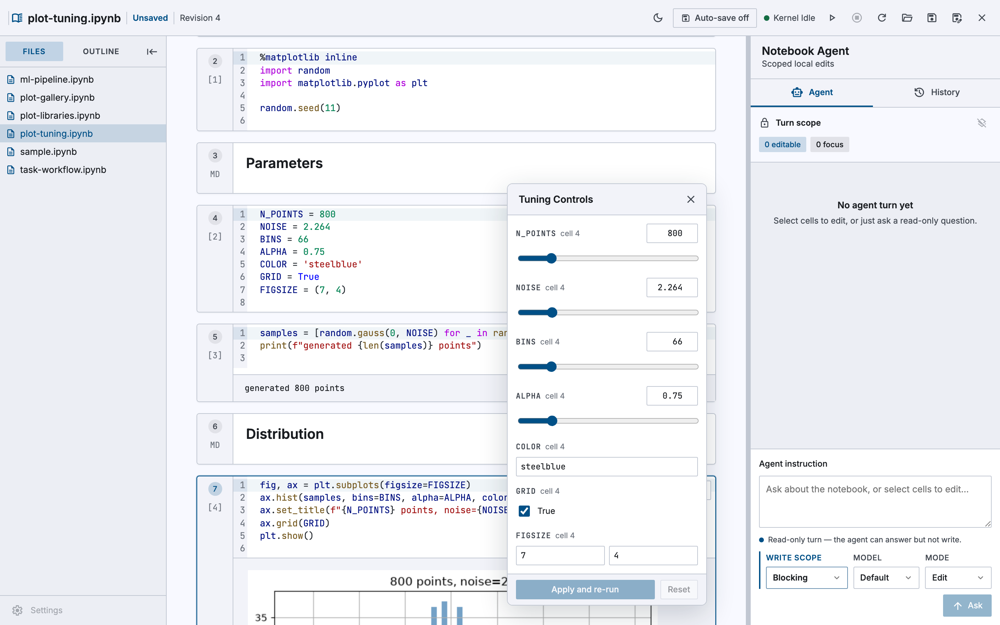

# Local Notebook Agent Editor

## Demo

https://github.com/user-attachments/assets/e52a4ee7-3bb2-4953-a515-4c32f8742c6f


A local FastAPI + React editor for working on Jupyter notebooks with scoped AI
agent editing. You open a local `.ipynb` file (or a project folder), edit and
execute cells, and save in place. Each agent turn has a **scope**: in
**Blocking** mode the agent may only rewrite the source of cells you explicitly
mark editable; in **Trusted** mode the whole notebook is editable and the agent
may add, delete, reorder, and retype cells. Either way the backend validates and
applies (or rejects) every change — the agent never mutates your notebook
directly — and every change is reviewable as a diff and undoable.

Everything runs on your machine and binds to loopback only. Read
[Security Limits](#security-limits) before using it with untrusted notebooks.

## Install

**You work in the browser tab.** An MCP client — Claude Code, for instance — is
how you start it: it launches the editor, opens the tab, and can then edit and
run cells alongside you through tools, against the same session. [Running it
locally](#run-it-locally-instead) is the other way in, for working on the
editor itself.

Any client that speaks stdio MCP works; nothing here is specific to Claude
Code. You need that client, Python 3.11+, and — for the tab's agent chat — the
`claude` CLI on your `PATH`, at a version the adapter accepts (see [Claude
CLI](#claude-cli)). Without it the tab still opens, edits and runs; only its
chat is blocked. The wheel carries the tab with it, so there is nothing to
clone and no Node toolchain.

### Which Python runs your cells

Cells run in the environment the editor is installed into, and that
environment's kernel wins over any you have registered. Install it apart from
your notebook's dependencies and `import pandas` fails.

So either install it beside them:

```bash
pip install notebook-editor-mcp        # in your project's environment

claude mcp add agent-notebook -- \
  /abs/path/to/.venv/bin/notebook-editor-mcp \
  --workspace-root /abs/path/to/project
```

…or keep it separate and point `--kernel-python` at them, which is what makes
`uvx` usable on a real notebook:

```bash
claude mcp add agent-notebook -- \
  uvx --from notebook-editor-mcp notebook-editor-mcp \
  --workspace-root /abs/path/to/project \
  --kernel-python /abs/path/to/.venv/bin/python
```

Pass the `python` inside the environment, not a resolved path: a virtualenv's
`bin/python` is a symlink whose target has none of the virtualenv's packages.
That environment needs `ipykernel`. A wrong path or a missing `ipykernel` fails
at launch, with the command to fix it, rather than at the first cell.

### Opening the tab

The tab opens by itself on your client's first tool call, whichever it is, once
per session; `show` brings it back whenever you want it. You never have to ask
for it — a session that begins with `status` or `read` gets a window just the
same, because the moment a run stops for approval there has to be somewhere for
that to appear.

On a headless or remote host nothing can pop up, so `open` returns the URL as
`editorUrl` for the client to hand you and `show` returns it again. Automation
that wants no window passes `--no-browser`, which leaves `show` working.

Everything the editor does is in that tab: the agent chat, per-hunk diff review
on the cell a change belongs to, the approval gate a risky run parks at, the
plot tuner and the notebook map.

### The workspace

`--workspace-root` confines every path the editor will open, list or write to
one directory. It is optional and strongly recommended: without it the editor
reaches anywhere you can. Use absolute paths for it and for the executable —
the client decides what directory the server starts in. A typo fails at launch.

Name a notebook that is not there and the error lists the `.ipynb` files that
*are*, so the client can pick one rather than guess again.

### What the client can do too

The client can drive the notebook while you watch, against the same session
you are working in. The tools are named for what they do and nothing more,
because clients that namespace them by server name — Claude Code renders them
`mcp__agent_notebook__open` — would otherwise produce `notebook_open` inside a
namespace already called notebook.

`open`, `read`, `status`,
`set_cell_source`, `insert_cell`, `delete_cell`,
`run_cell`, `run_all`, `cancel_run`, `save`, `show`.

Three things the tab guarantees you, whatever the client does:

- **You approve anything risky before it runs.** Execution a tool asks for is
  agent-initiated, so a cell the risk classifier flags stops at *awaiting
  approval* and waits for you — the same gate an agent turn's downstream cells
  get.
- **Your edits win.** Change a cell in the tab and a client writing against the
  version it last read is refused and told to re-read. Nothing retries over the
  top of your work.
- **New cells arrive for review, not already run.** `insert_cell` marks its
  cell agent-authored, the tab badges it "review before running", and leaves it
  inert. Running it is a separate call through the same approval gate.

Agent turns are **not** exposed as tools — the client is already the agent, and
running the `claude` CLI underneath it would just nest a second one. The tab's
chat is where a turn gets sent, and it works exactly as it does locally.
Neither is the file browser exposed: the tab has a picker, and a person
browsing their own machine is a different thing from a model enumerating it.

### Watching it work

Run as an MCP server the editor is a child process the client starts for you,
on a port chosen at random, with stdout reserved for the protocol. That is
three ways in which the usual `scripts/dev.py` habits do not apply, so:

- **The port is announced on stderr**, where MCP clients keep their server
  logs: `notebook editor ready at http://127.0.0.1:PORT (log: ...)`. Open that
  URL and you are looking at the same session the tools are driving. The same
  URL comes back as `editorUrl` from `open`, and from
  `show` on request.
- **`NOTEBOOK_EDITOR_LOG=/path/to/editor.log`** keeps the editor's own log at a
  path you choose instead of a temp file that is deleted when it stops. This is
  what to set before `tail -f`. Unset, a *failed* start is still drained and
  reported in the error, so you only need this for watching a server that is
  working.
- **Never print to stdout** from the server process. It is the transport; a
  stray `print` corrupts the protocol rather than showing up somewhere.

To see the tool surface without wiring up a client, the MCP Inspector speaks
the same stdio protocol:

```bash
npx @modelcontextprotocol/inspector \
  .venv/bin/notebook-editor-mcp --workspace-root /absolute/path --no-browser
```

Read [Security Limits](#security-limits) before pointing a client at a notebook
you would not run yourself.

## The interface

The editor at rest: files and the notebook map on the left, the notebook in the
middle, the agent on the right. Nothing is scoped yet, so the composer says so —
a turn sent now is read-only.



After a turn, changed cells become reviewable in place — an inline diff on the
cell it belongs to, accepted or rejected per hunk, not a patch file you read
somewhere else. The review bar counts what is pending and names the turn it came
from; the agent's answer stays beside the diff, so what it claims to have done
and what it actually changed are on screen together. Here two of the three
scoped cells were rewritten, and the panel explains why the third was left
alone.



<table>
<tr>
<td width="30%"></td>
<td>

**The notebook map.** The Outline tab segments the notebook into blocks and
asks the model to name each one, so a long notebook has a table of contents it
never had. Names are generated — they carry a dotted underline to say so —
while the cell ranges under them are computed. **Rebuild map** re-derives it
after the notebook moves on.

</td>
</tr>
</table>

Plots get knobs. **Tune** scans the cells above a figure for values it can vary
safely — sizes, counts, colours, flags — and puts each on a control, floating
over the notebook so the picture keeps the full width of the cell. Moving one
re-runs the cell into a preview labelled *not in your notebook yet*; **Apply and
re-run** is what writes the values back. Nothing is committed until you press it.



Screenshots are captured from a live session against the notebooks in
`examples/`, with a real kernel and the real Claude CLI. See
[`docs/screenshots/`](docs/screenshots/) for the full set and how to re-capture
them.

## Run it locally instead

For working on the editor itself, or to use the browser UI on its own with
agent turns driven from the tab rather than from an MCP client.

### Prerequisites

- **Python** 3.11+
- **Node.js** 20.19+ or 22.12+, with **npm**
- A local Python kernel (installed with the backend below via `ipykernel`)
- **Claude CLI** — required only for agent turns (see [Claude CLI](#claude-cli))
- **macOS or Linux.** The launcher and Playwright cleanup use POSIX process
  groups/signals. Windows is out of scope for v1.

### Setup

From the repository root:

```bash
python -m venv .venv
.venv/bin/pip install -e '.[test]'
npm install
```

Playwright is only needed if you plan to run the end-to-end suite:

```bash
npx playwright install chromium
```

### Claude CLI

Agent turns shell out to the `claude` command-line tool. You can open, edit,
run, and save notebooks without it — the CLI is only invoked when you send an
agent turn.

**1. Install it** using either official method:

```bash
# Native installer (installs to ~/.local/bin)
curl -fsSL https://claude.ai/install.sh | bash

# …or via npm
npm install -g @anthropic-ai/claude-code
```

Make sure `claude` is on your `PATH` (the app runs the `claude` executable
directly):

```bash
which claude
```

**2. Authenticate it once.** Run `claude` on its own and complete the login
flow (an Anthropic account / Claude subscription, or an API key). The app
launches the CLI non-interactively per turn and does not handle login for you.

**3. Match the supported version.** The adapter verifies the CLI before every
turn and **requires `claude >= 2.1.203` and `< 2.2.0`**. It relies on
`--safe-mode`, `--disable-slash-commands`, `--strict-mcp-config`, `--tools`,
and `--permission-mode`. Check your version:

```bash
claude --version
```

If it falls outside that range, agent turns fail fast with **"Unsupported
Claude CLI version"**; if `claude` is missing from `PATH`, you get **"Claude
CLI is unavailable."** In both cases opening/editing/running notebooks still
works — only agent turns are blocked.

> **Just want to try the UI without Claude?** Start the app with
> `--test-agent` (see [Run](#run)) to use a built-in deterministic adapter.
> It produces canned Blocking-mode edits for demoing the flow and never calls
> the real CLI — it does not perform Trusted structural edits, and it is not a
> substitute for a real agent.

### Run

One command starts FastAPI at `http://127.0.0.1:8000` and Vite at
`http://127.0.0.1:5173`:

```bash
.venv/bin/python scripts/dev.py
```

Then open **http://127.0.0.1:5173**.

Useful flags:

```bash
# Run against the built-in deterministic adapter instead of the real Claude CLI
.venv/bin/python scripts/dev.py --test-agent

# Use different ports (the Vite dev server proxies /api to the backend port)
.venv/bin/python scripts/dev.py --backend-port 8055 --frontend-port 5199
```

## Using it

1. **Open a notebook.** From the start screen choose a local `.ipynb` file, or
   open a project folder to browse and edit its notebooks in place. There's
   also an upload/download path if you prefer working on a copy.
2. **Edit and run cells.** Edit cell source directly and run cells against the
   local kernel. Toggle **Auto-save** or use **Save** / **Save As** to write
   back to disk.
3. **Scope cells for the agent.** Two independent axes: mark cells **editable**
   (permission — the agent may rewrite their source) and/or pin cells as
   **Focus** (salience — the cells most relevant to your request; attention only,
   see the security note). Sending a prompt with no editable cells is a valid
   read-only turn: the agent answers but writes nothing.
4. **Pick a scope, model, and mode** in the agent composer:
   - **Write scope** (composer footer, beside Model and Mode) — **Blocking**
     (default) lets the agent edit
     only the cells you marked editable; **Trusted** makes the whole notebook
     editable and lets it add/delete/reorder/retype cells. In Trusted the
     per-cell "allow agent edit" control is hidden and every pin is a Focus hint.
   - **Model** — Default, Opus, Sonnet, or Haiku. Default defers to the CLI's
     own default; otherwise it is passed as `--model`.
   - **Mode** — **Edit** applies scoped changes; **Plan** returns a
     step-by-step plan and writes nothing.
5. **Send.** Review the agent's answer and the inline diffs on changed cells. A
   Trusted turn also shows a summary of structural changes (added / deleted /
   reordered / retyped) and marks agent-added cells with a provenance badge;
   Trusted turns apply structure only and do **not** auto-run cells — you run
   them after reviewing. You can undo an applied turn (whole-turn undo).

## The outline panel

The sidebar's **Outline** tab is a map of the open notebook: contiguous ranges
of cells, each with a name and a cell range. Click a block to jump to its first
cell; hover to highlight everything it covers in the gutter. It is navigation
only — **nothing it shows is ever written to the `.ipynb`**.

One field is generated and the rest are computed, and the panel renders them
differently on purpose:

- **The name** is written by a model, and carries a dotted underline to say so.
  Every block cites its own cell range, so a name you disagree with is checkable
  in one click rather than something you have to trust.
- **Everything else is computed from the AST**, with no model involved: the cell
  range, the variables the block **produces** that later cells read, the
  functions it **defines** and which cells call them (including ones never
  called), and any **markdown headings** inside the range. Expand a block to see
  the last three.

**The boundaries are computed too.** They fall where the notebook's vocabulary
changes — comparing the identifiers used either side of each seam and cutting at
the valleys. Markdown headings are not consulted at all, which is the point: the
notebooks that most need a map are the ones without them. An earlier version cut
at every heading, and measuring it against nine real notebooks
(`docs/plans/probes/corpus/`) showed why that had to change — it cost a reader
21.5 cells to find what they were looking for, against 9.3 for this, and lost
even to cutting blindly every eight cells.

**So the model call is spent on naming, not on segmenting.** The same
measurement found a model-drawn partition indistinguishable from the computed
one, so **Build map** hands the model the blocks and asks only what to call
them. Three things follow: the map cannot come back malformed, because the
boundaries were never the model's to return; the same notebook always segments
the same way, where an earlier version's block count moved 12% between identical
runs; and the free map you see before pressing anything is a real map rather
than a placeholder.

**Opening a notebook costs nothing.** The computed fields are an AST parse and
refresh on every document revision, so running a cell updates the panel without
touching the names. Only **Build map** spends anything, and only when you press
it.

**Build map** is one `claude` call: cell *source* only — never outputs, at any
size — with no tools, no MCP servers, and a throwaway working directory, so the
pass can read, write and run nothing. It defaults to Haiku. The result is cached
per notebook path and survives cell runs; editing a cell marks the map **stale**
but leaves it on screen until you rebuild.

Three ways it declines to guess, all visible in the panel:

- **No model pass yet** (or one that failed) shows the computed blocks with the
  cell range where the name would be, and says names need a model. It does not
  invent one.
- **An answer that is not one name per block** is discarded rather than
  rendered, and the reason is shown. The previous map, if any, stays.
- **Above ~500 cells** it refuses outright instead of segmenting a prefix and
  presenting it as the whole map.

## Verify

```bash
.venv/bin/python -m pytest backend/tests -q   # backend unit/integration tests
npm test -- --run                             # frontend unit tests
npm run build                                 # type-check + production build
npm run test:e2e                              # Playwright end-to-end (needs chromium)
```

The Playwright suite opens `examples/sample.ipynb` and covers desktop and
mobile workflows. Screenshots and failure traces are written under
`test-results/`.

The MCP surface is checked at three depths, and it is worth knowing which one
to reach for:

| | What it covers | Cost |
|---|---|---|
| `pytest backend/tests/test_mcp_server.py` | the tool surface against fakes — errors, revisions, descriptions | instant |
| `pytest backend/tests/test_mcp_end_to_end.py` | the tools against a real editor, kernel and approval gate | seconds |
| `python evals/mcp_tool_eval.py` | whether a *model* drives the tools well | a minute per run, and tokens |

Only the last one needs an authenticated `claude` CLI, which is why it is not
in CI. It answers a different question from the other two: not "does the tool
work" but "does a model reach for the right one, fetch no more than it needs,
and ignore a notebook that tells it to do something else".

```bash
python evals/mcp_tool_eval.py                 # every task, once each
python evals/mcp_tool_eval.py --repeat 3      # a pass rate, not a pass
python evals/mcp_tool_eval.py \
  --model claude:sonnet --model claude:haiku  # the same tasks, two models
```

`--model` takes `client[:model]` and repeats. A tool description that only
reads well to the strongest model is a defect a single-model suite cannot see —
running Haiku alongside Sonnet is what makes that visible.

Two clients are wired: `claude` and `codex`. The Claude path is the verified
one. The Codex path was built against the CLI's own help and shipped event
names without a credential to run it, so treat its first run as a shakedown: if
the transcript does not match what the parser expects it says so, naming the
event types it saw, rather than reporting a run that used no tools. Codex needs
`codex login` first — the harness deliberately does not touch `CODEX_HOME`,
which is where that credential lives.

They are not perfectly matched. Claude runs with `--tools ""`, so the MCP
surface is the only way to reach the notebook at all. Codex has no equivalent
switch and runs under a read-only sandbox instead: it cannot write the notebook
by other means, but it could read one without the tools. Every task asserts the
surface was used, so such a run fails rather than passing hollowly.

## Security Limits

The editor binds to loopback and keeps one active notebook in process memory.
The agent workspace contains the full notebook, so the agent can read every
cell. Focus (attention) selection is an attention signal in the manifest and
prompt, not a confidentiality control. In **Blocking** turns, writes are imported
only from manifest-listed editable-cell source files; notebook structure,
metadata, outputs, and unselected-cell writes are rejected at the workspace
boundary. **Trusted** turns widen this to the whole notebook (see below). Risk
classification pauses selected downstream operations for explicit approval.

**Trusted turns** (the per-turn Blocking/Trusted toggle) widen the write boundary to
the whole notebook and let the agent **add, delete, reorder, and change the type of**
cells — including introducing **new executable code cells** you never scoped, and
changing execution order. The backend still derives, validates, and applies every
change (the agent never edits the notebook directly), and OS posture is unchanged (no
shell, loopback only). But this makes **review-before-run load-bearing**: agent-added
cells are marked with a provenance badge and are not auto-executed, yet once accepted
they are ordinary cells a later Run-All will run. Review the diff before running, and
use Trusted only with agents and instructions you trust. The risky-cell execution
approval flow still gates execution.

**Driving it from an MCP client** narrows two of these and widens one. Model-
initiated runs are gated, where a click of Run is not, and `--workspace-root`
confines every path the server accepts. But the notebook's own text — markdown,
code, and cell outputs — is read into the model's context while that same model
holds a tool that executes cells. A notebook from somewhere you do not trust
can therefore carry instructions to an agent that can run code on your machine.
The approval pause is the control that matters there; do not wave it through.

This is not an operating-system sandbox. The CLI and executed notebook code run
with the current user's permissions. Risk classification is heuristic, approval
does not make code safe, and notebook execution can read files, use
credentials, access the network, or start processes. Use the editor only with
notebooks and agent instructions you trust.

## Contributing

Contributions are welcome — see [CONTRIBUTING.md](CONTRIBUTING.md) for setup,
the checks CI runs, and pull-request guidelines. Participation is governed by
our [Code of Conduct](CODE_OF_CONDUCT.md). To report a vulnerability, see
[SECURITY.md](SECURITY.md).

## License

Released under the [MIT License](LICENSE).
