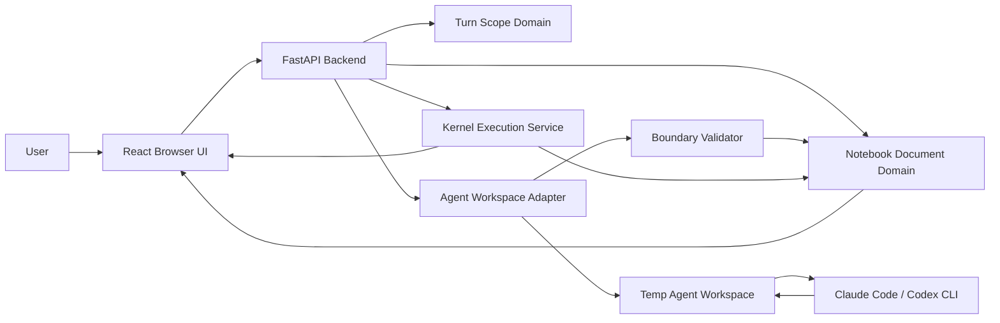

# Local Notebook Agent Editor Spec

## Status

Draft v1 product and architecture specification.

This document captures the confirmed design for a local notebook editor focused on
cell-scoped AI agent edits. It is intended to be completed before implementation.

## Understanding Summary

- Build a standalone local notebook editor served by a local backend with a browser UI.
- Support uploading, downloading, editing, and running `.ipynb` notebooks.
- Integrate external local CLI coding agents first, such as Claude Code or Codex.
- Let users grant per-turn edit permission to specific notebook cells.
- Let agents read the whole notebook and explicit context cells, but write only to cells in the current turn's editable set.
- Make scoped edit trust the primary v1 success criterion.
- Avoid collaboration, cloud/team workflows, dashboard/data-app features, plugin ecosystems, and formats beyond `.ipynb` in v1.

## Target User

The v1 user is a solo data scientist or ML engineer working locally with small or
medium Jupyter notebooks and AI coding agents.

## Goals

- Provide a local notebook-first editor with native AI scope controls.
- Make it obvious which cells the agent can edit in the current turn.
- Mechanically enforce the editable-cell boundary in the backend.
- Support read-only agent turns that answer or explain through the same scope
  selector and write boundary, without requiring an edit.
- Provide Cursor-style immediate application of valid changes with visible color-coded diffs.
- Provide Cursor-style review of applied changes: Keep/Undo per hunk and per cell
  in the notebook UI, and whole-turn undo in chat.
- Run affected downstream notebook cells after valid edits and show results to both user and future agent context.
- Support upload/import and download/export file operations for `.ipynb`.

## Non-Goals

- No collaboration, cloud sync, comments, or team governance in v1.
- No rich data-app/dashboard builder features in v1.
- No plugin ecosystem in v1.
- No notebook formats beyond `.ipynb` in v1.
- No full OS sandboxing of external CLI agents in v1.
- No structural notebook edits by the agent in v1.
- No durable undo/audit history across app restart in v1.

## Architecture Overview

V1 uses a local FastAPI backend serving a React browser UI.

The system is divided into bounded contexts:

- Notebook Document
- Turn Scope
- Agent Workspace
- Boundary Validation
- Kernel Execution
- UI Session

The core architectural rule is:

> Agent integration must not own notebook mutation. It can produce candidate
> cell-source changes; the Notebook Document domain applies or rejects them.

## Architectural Invariants

These invariants are non-negotiable and should be enforced in code and tests:

- The live notebook document is mutated only by Notebook Document use cases.
- The external CLI agent never receives write access to the live notebook document.
- The backend never imports modified `notebook.ipynb` from the temp agent workspace.
- The backend reads candidate edits only from files listed in the frozen turn manifest.
- A candidate source change is valid only when its `cellId` is in the frozen editable set.
- Turn scope expires after the turn completes, fails, or is cancelled.
- Undo restores notebook document state, not kernel process state.
- UI state is advisory; backend validation is authoritative.
- Cell IDs are valid and unique before a notebook session becomes editable.
- At most one notebook-mutating operation owns the session mutation lease.
- Kernel results are committed only for the active execution attempt and the
  exact cell source revision that was executed.
- Approval and cancellation commands are correlated to immutable attempt IDs
  and are idempotent.

## High-Level Runtime Diagram



The most important dependency direction is from orchestration toward domain
services. The agent adapter, kernel runner, and UI should depend on notebook
domain interfaces rather than owning notebook mutation themselves.

## Bounded Contexts

### Notebook Document

Responsibilities:

- Load and parse `.ipynb` files.
- Validate basic notebook structure and format version before identity
  normalization, then run full nbformat validation afterward.
- Normalize missing, invalid, and duplicate standard nbformat cell IDs.
- Upload/import and download/export.
- Open a notebook from a path within the workspace root and save it in place
  (see `Workspace Root`), tracking the on-disk baseline used to guard writes.
- Close/unload the active notebook without terminating the application.
- Track dirty state, where dirty means changed since the last successful disk save.
- Maintain a monotonic document revision and mutation ownership metadata.
- Store in-memory checkpoints.
- Apply validated source changes atomically.
- Restore notebook document state during undo.

Out of scope:

- Agent process orchestration.
- UI rendering.
- Kernel side-effect analysis.

Core use cases:

- `LoadNotebook`
- `NormalizeCellIds`
- `OpenNotebookFromPath`
- `CreateNotebookCheckpoint`
- `ApplyValidatedCellSourceChanges`
- `RestoreNotebookCheckpoint`
- `SaveNotebookToDisk`
- `ExportNotebook`
- `CloseNotebook`

Revision and mutation rules:

- Every source, output, execution-count, metadata-normalization, or checkpoint
  restoration mutation increments the document revision.
- Agent turns and manual execution acquire a session mutation lease before
  starting. Only the lease owner may commit mutations until it reaches a
  terminal state.
- While a mutation lease is active, imports, source edits, turn-scope changes,
  undo/reject, manual execution, close, and new agent turns fail with `409 Conflict`.
  Download may read a consistent snapshot. Accepting a reviewed change is not a
  document mutation and is unaffected.
- Each mutation records its primary owner (`manual`, an agent `turnId`, a
  `reject:`/`revert:` owner derived from a turn, or a manual execution
  `attemptId`). Agent-triggered execution results retain their child attempt ID
  but use the parent `turnId` as mutation owner, so undo eligibility can be
  checked without relying on UI history.

### Turn Scope

Responsibilities:

- Track editable cells for the next agent request.
- Track read-only context cells for the next agent request.
- Expire scope after a terminal turn that applied changes; preserve the selection
  after a terminal turn that applied nothing (see the no-op preservation rule below).
- Preserve terminal turn scope and outcome in visible in-session history for audit/debugging.

Rules:

- Permissions are turn-level, not thread-level.
- A cell mentioned as editable in one turn is not editable in the next turn unless
  explicitly added again — **except** when the intervening turn applied no changes.
- **No-op scope preservation.** When a turn ends without applying any change (for
  example the agent asks a clarifying question, or a read-only answer), the notebook
  revision is unchanged, so the editable/context selection is kept for the follow-up
  turn instead of being cleared. The user can reply to the clarification without
  re-scoping. The selection expires as usual once a turn applies an edit, on session
  replacement, or when the user clears it. Preservation only applies while the kept
  selection still matches the current session and revision.
- Drag/drop into chat adds a cell to the editable set by default.
- Cell gutter controls expose both "Add as context" and "Add to edit".
- Cells can also be selected in bulk (click, shift-click for a range) and scoped
  together through a right-click context menu, which adds the whole selection to
  the editable or context set in one action. Bulk scoping is a UI affordance over
  the same per-cell add operations; the backend still records each cell add.
- The editable set may be empty. A turn with no editable cells is a valid
  read-only turn: the agent reads and answers but is granted no write surface.
  Context cells are optional and independent of whether the turn can write.

Core use cases:

- `AddEditableCellToTurnScope`
- `AddContextCellToTurnScope`
- `FreezeTurnScope`
- `ClearTurnScope`
- `RecordTerminalTurnScope`

### Agent Workspace

Responsibilities:

- Create a fresh temporary workspace for each agent turn.
- Provide the full notebook as read-only context.
- Provide writable plain-source files only for editable cells.
- Provide a manifest mapping editable cells to files.
- Launch the configured local CLI agent.
- Collect candidate changes after the agent exits.
- Audit protected and writable workspace paths after the agent exits.
- Enforce CLI timeout, cancellation, and process-tree cleanup.

The agent workspace is disposable and should not be treated as source of truth.

Core use cases:

- `CreateAgentWorkspace`
- `WriteAgentInstructions`
- `LaunchCliAgent`
- `CollectEditableCellFileChanges`
- `DestroyAgentWorkspace`

Adapter contract:

- Each supported CLI adapter declares its exact command template, compatible
  CLI versions, edit/propose mode, terminal-tool denial mechanism, auxiliary
  files it may create, timeout behavior, and cancellation strategy.
- An adapter that cannot start non-interactively with terminal/tool execution
  denied is unsupported in v1 and must fail before the turn starts.
- This is a cooperative adapter restriction, not an OS security boundary. A
  compromised or non-conforming CLI process may still use its ambient OS
  permissions, as described in Security And Privacy Posture.

### Boundary Validation

Responsibilities:

- Compare candidate changes against the immutable turn scope.
- Reject invalid changes before they reach the live notebook state.
- Retry up to two times after boundary violations.
- Produce user-visible boundary violation errors when retries fail.

Core use cases:

- `ValidateCandidateChangeSet`
- `DetectBoundaryViolation`
- `BuildRetryInstruction`
- `CreateValidatedChangeSet`

### Kernel Execution

Responsibilities:

- Resolve and launch the notebook session's kernel through a `KernelProvider`
  for the bound `EnvironmentSpec`, rather than hardcoding a single environment.
- Run notebook cells through that kernel.
- After valid edits, execute code cells from the first edited cell onward.
- Skip Markdown cells.
- Detect risky cells before execution.
- Request approval for risky downstream cells.
- Stop execution if the user declines a risky cell.
- Store outputs/errors in the agent turn log for follow-up context.
- Support user-initiated run-cell and run-all operations.
- Interrupt or restart the active kernel.

Core use cases:

- `ListAvailableEnvironments`
- `ResolveKernelEnvironment`
- `StartKernelSession`
- `ClassifyRiskyCell`
- `ExecuteDownstreamCells`
- `RequestRiskyExecutionApproval`
- `CaptureExecutionResult`
- `ExecuteCell`
- `ExecuteAllCells`
- `InterruptKernel`
- `RestartKernel`

See `Kernel Environment` for the provider model. The current implementation
resolves to a single `local-interpreter` provider bound to the backend's own
Python environment; the abstraction exists so this becomes selectable and,
later, non-local without changing the execution, lease, or approval logic.

### UI Session

Responsibilities:

- Render notebook cells.
- Render hover/selection gutter controls.
- Render chat and turn-scope lists.
- Render color-coded diffs.
- Render per-operation, per-cell, and whole-turn review actions.
- Render dirty state, upload/download controls, and execution status.

Core use cases:

- `RenderNotebookCells`
- `RenderCurrentTurnScope`
- `RenderAgentTurnHistory`
- `RenderScopedDiffs`
- `RenderInlineCellDiffDecorations`
- `RequestAgentTurn`
- `UndoAgentTurn`
- `RevertCellChange`
- `RunNotebookCell`
- `RunAllNotebookCells`
- `InterruptKernelExecution`
- `RestartKernelSession`

## Suggested Backend Module Boundaries

The backend should avoid generic folders such as `utils` or `helpers`. Use
domain-specific modules that match the bounded contexts:

```text
backend/
  app/
    api/
      notebook_routes.py
      turn_scope_routes.py
      agent_turn_routes.py
      execution_routes.py
    notebook_document/
      models.py
      repository.py
      nbformat_service.py
      mutation_coordinator.py
      checkpoint_service.py
      source_change_service.py
    turn_scope/
      models.py
      service.py
    agent_workspace/
      models.py
      workspace_builder.py
      adapter_registry.py
      cli_agent_runner.py
      change_collector.py
      workspace_auditor.py
    boundary_validation/
      models.py
      validator.py
      retry_policy.py
    kernel_execution/
      models.py
      kernel_session.py
      risky_cell_classifier.py
      downstream_runner.py
      execution_coordinator.py
    session_history/
      models.py
      service.py
```

The route layer should stay thin. It should parse requests, call use-case
services, and return response DTOs. Notebook mutation, agent orchestration, and
execution policy should not live in route handlers.

## Suggested Frontend Module Boundaries

```text
frontend/
  src/
    app/
      App.tsx
      routes.tsx
    notebook/
      NotebookView.tsx
      NotebookCell.tsx
      CellEditor.tsx
      CellGutterActions.tsx
      cellDiffModel.ts
    turnScope/
      TurnScopePanel.tsx
      turnScopeStore.ts
    agentChat/
      AgentChatPanel.tsx
      AgentTurnHistory.tsx
      AgentTurnControls.tsx
    execution/
      RiskyExecutionDialog.tsx
      ExecutionStatus.tsx
      KernelControls.tsx
    fileOperations/
      FileToolbar.tsx
      fileOperationsApi.ts
    api/
      client.ts
```

The frontend should keep permission state visible, but it should not be trusted
for enforcement. Every agent turn request must be validated by the backend using
the current server-side notebook state and frozen turn scope.

## Core Domain Models

These are conceptual models, not final class definitions:

```text
NotebookSession
  sessionId
  workspaceRoot?     # project folder the session is rooted at
  notebookPath?      # notebook file location within the workspace root
  notebook
  revision
  dirty              # changed since the last successful disk save
  onDiskBaseline?    # file mtime + content hash captured at open/last save
  mutationLease?
  environmentRef?
  checkpoints[]
  turnHistory[]

EnvironmentSpec
  environmentId
  kind          # local-interpreter | container | remote-gateway
  identifier    # interpreter path, kernelspec name, image ref, or gateway URL
  displayName
  capabilities  # interrupt, restart, provisioning, isolation

NotebookCellRef
  cellId
  index
  cellType
  preview

TurnScope
  turnId
  notebookRevision
  editableCellIds[]
  contextCellIds[]
  prompt
  frozenAt

CandidateCellSourceChange
  cellId
  previousSource
  nextSource
  tempFilePath

ValidatedChangeSet
  turnId
  notebookRevision
  changes[]

ExecutionResult
  executionAttemptId
  cellId
  startingDocumentRevision
  sourceHash
  status
  outputs
  executionCount
  error?

PendingRiskyExecution
  executionAttemptId
  turnId
  cellId
  cellIndex
  expectedDocumentRevision
  expectedSourceHash
  preview
  reasons[]
  status

AgentTurn
  turnId
  baseRevision
  state
  activeExecutionAttemptId?
  createdAt
  completedAt?

MutationLease
  ownerType
  ownerId
  acquiredAt
```

Agent turn states are:

```text
created -> agent_running -> validating -> applying -> executing
executing -> awaiting_approval -> executing
created | agent_running | validating | applying | executing | awaiting_approval
  -> completed | validation_incomplete | failed | cancelled
```

Terminal transitions release the mutation lease, clear the frozen current-turn
scope, record history, and clean up the workspace. State transitions use
compare-and-set semantics so duplicate cancellation or approval requests do not
repeat side effects.

Modeling these concepts explicitly is important because the product's main
value is not generic chat. The value is controlled transformation of notebook
cell source under a precise permission model.

## Manual Notebook Editing

Users may edit notebook cells directly in the UI outside the agent flow.

Rules:

- Manual user edits are trusted edits to the live notebook session.
- Manual edits are not passed through the agent boundary validator.
- Manual edits update the notebook revision and dirty state.
- Manual edits require the current document revision and fail with
  `409 Conflict` while a mutation lease is active or if the supplied revision is
  stale.
- Agent boundary validation applies only to candidate changes produced by agent turns.

Manual execution:

- Users may explicitly run one code cell or all code cells, interrupt execution,
  and restart the kernel.
- A manual run acquires the same session mutation lease used by an agent turn.
- Clicking a manual run command is explicit authorization to execute the chosen
  cells, so the automatic risky-cell confirmation flow is not repeated.
- Each result is committed only if its execution attempt still owns the lease
  and the executed cell's source hash still matches.

## Permission Model

The core rule:

> A cell is writable only if its standard nbformat cell ID appears in the
> current turn's editable set.

Allowed in v1:

- Edit source of editable code cells.
- Edit source of editable Markdown cells.
- Update outputs and execution counts through kernel execution.

Not allowed in v1:

- Add cells.
- Delete cells.
- Reorder cells.
- Change cell type.
- Change notebook metadata.
- Change cell metadata.
- Directly write outputs.
- Persist edit permission across turns.

Read permissions:

- The external agent may read the full notebook.
- The external agent may read cells explicitly added as context.
- V1 assumes the local CLI agent environment is trusted; the app does not try to enforce full OS read isolation.

Write enforcement:

- The UI communicates scope, but the backend enforces scope.
- The live `.ipynb` document is never edited directly by the CLI agent.
- Only validated source changes from editable temp files can enter the notebook.

Read-only turns:

- The editor is a scoped-context selector wrapped in a write boundary; editing
  is one thing an agent may do inside that boundary, not a requirement of every
  turn. A turn with an empty editable set is a valid read-only turn — for
  example "explain what these cells do".
- A read-only turn is the strongest case of the same boundary: an empty editable
  set is zero write surface, so no candidate change can be valid. The turn
  completes as a no-op whose payload is the agent's final textual answer, with no
  applied changes and no downstream execution.
- Read-only turns require a prompt but no editable or context cells. They read
  the full notebook like any turn; because context is already not a read
  boundary, a read-only turn changes nothing about confidentiality — it only
  removes write capability.

Edit permission is a grant, not an obligation:

- Placing a cell in the editable set grants write permission for the turn; it
  does not require the agent to write. The agent answers the request first and
  edits only when the request calls for a concrete change.
- A question asked with editable cells in scope (for example "what would be
  useful here?") may complete with only an answer and no change, using the same
  empty-candidate no-op path as any other turn. When the agent does edit, it
  explains the change; the applied edit is reviewable through the diff and
  reversible through per-cell revert and whole-turn undo.
- The turn instructions state this explicitly so the agent does not treat edit
  permission as a command to modify code.
- "Propose" here means apply-then-review: a warranted edit is applied
  immediately and made reviewable through the diff, per-operation and per-cell
  Keep/Undo, and whole-turn undo. There is no separate un-applied proposal state
  in v1; a held "pending change the user must accept" model is deferred.
- Review is explicitly *settled* rather than left to lapse: accepting a change
  marks it reviewed and clears its diff without touching the document. "Accept"
  here therefore means "reviewed", not "committed" — the change was already
  live. The UI says **Keep** for that reason.

## Trusted Mode (per-turn, whole-notebook structural editing)

Each turn carries a `writeScope` of `blocking` (the default, above) or `trusted`.
The toggle is **sticky** in the UI: it persists the last-selected scope across
turns until changed. Trusted has effect only in Edit mode (Plan writes nothing).

In a **Trusted** turn the editable set is implicitly the **whole notebook** and the
agent may perform full structural edits — **add, delete, reorder, and change the
type of** any cell, in addition to editing source. This deliberately widens the
otherwise-forbidden v1 operations for trusted turns only; Blocking turns keep the
scoped, source-only boundary unchanged.

The gate is kept, not dropped. The backend still owns mutation:

- The agent edits an agent-writable `structure.json` (ordered cell list) plus a
  per-cell source file under `cells/`; **adds carry no cell id** (`{"op":"add", …}`)
  so no id string is ever a sentinel.
- The backend diffs the returned structure against the frozen original (held
  immutably in memory) to **derive** ordered ops, then **validates** them:
  well-formed JSON, supported `cellType`, resolvable non-duplicate ids, containment
  under `cells/`, and a **zero-cell floor** (a turn may not empty the notebook).
- Structural apply is **atomic** and guarded on **session id + revision** (a mid-turn
  session replacement cannot cause a wrong-notebook apply). Whole-turn undo restores
  the pre-turn checkpoint verbatim.
- Malformed-structure errors are **retryable** (bounded, fed back as a correction);
  scope violations remain non-retryable but cannot occur in Trusted.
- Trusted turns **apply structure only and do not auto-execute**; the user runs cells
  after review. Newly added cells are marked `metadata.agent_authored` and shown with
  a persistent provenance badge, because they can introduce executable code the user
  never scoped — review-before-run is load-bearing. The risky-cell execution approval
  flow is unchanged.

Attention only: in a Trusted turn the editable/context distinction is removed. The
whole notebook is writable, so the per-cell "allow agent edit" affordance is hidden and
any pinned cell — however it was added, including drag-and-drop, which defaults to a
Focus pin in Trusted — is a **Focus** cell: an attention hint, not a permission grant.
Both the editable and context sets collapse into a single Focus/attention list that is
forwarded to the agent (editable first, deduped). The scope panel renders every pin the
same, and the turn-history entry reads "all editable" rather than per-set counts.

Revert granularity in Trusted follows **per-operation independence**, not the turn
mode. A structural op is individually reviewable when undoing it needs nothing from
the rest of the notebook:

- `edit` on a surviving, same-type cell — reviewable per hunk, exactly as in
  Blocking. Source recompose, apply, and the staleness guard all key off the cell
  id and never its index, so the ordinary ledger holds even if the same turn also
  moved that cell.
- `add` — reviewable per cell. Undoing deletes that one cell by the id it was
  given when applied, guarded only by that cell still holding the source the turn
  wrote; a cell the user has since edited is stale and refuses, because deleting
  it would destroy their work.
- `delete`, `move`, `retype` — **whole-turn undo only**. Reversing one needs an
  anchor in an ordering that other ops in the same turn also changed, which
  requires a notebook-level composition; `retype` additionally drops outputs that
  only the checkpoint can restore. Cells touched only by these ops carry no ledger
  operations, keep their read-only diff, and say that whole-turn undo applies.

Per-cell revert on a Trusted turn therefore succeeds exactly when the cell carries
ledger operations, and fails with `409` otherwise. (An earlier draft refused it for
every cell on a Trusted turn; that was a deferral of the work above, not a property
of structural editing.)

Full design and review: `docs/plans/2026-07-28-trusted-mode-structural-editing.md`.

## Focus (attention) vs. editability

The turn-scope pins carry two independent axes that earlier UI wording ("context")
conflated:

- **Focus / attention** — *which cells are most relevant to this request.* User-facing
  label and the agent prompt both call this **Focus**. True in both modes.
- **Editability** — *may the agent edit this cell.* A per-cell grant in Blocking (the
  "allow agent edit" gutter control); implicit (whole notebook) in Trusted.

The pin never encodes permission. The agent learns edit-vs-read-only only from the
editable grant, so the Focus label and prompt line are permission-neutral: Blocking says
"Focus cells … (read-only unless also listed as editable above)", Trusted says "Focus
cells … (you may edit any cell)". (Internally the data model still names the attention set
`context` — API fields and CSS classes are unchanged; only the user-facing label and prompt
wording are "Focus".)

## Cell Identity

Cell boundaries use standard nbformat cell IDs.

Rules:

- Normalize identity before exposing an imported notebook as a session.
- Preserve existing IDs only when they are valid and unique.
- Generate replacement standard IDs for missing, invalid, or duplicate IDs. For
  duplicates, preserve the first valid occurrence and replace later occurrences.
- Validate the normalized notebook again before accepting the import.
- Treat ID normalization as an in-memory notebook mutation: increment revision,
  mark dirty, and include the IDs in the downloaded notebook.
- Include generated IDs in the downloaded notebook.
- Do not rely on cell indexes for permission boundaries.
- Show cell index/order in UI for readability, but use ID for validation.

## Agent Workspace Protocol

For each agent turn, the backend creates a fresh temporary workspace:

```text
turn-workspace/
  notebook.ipynb
  AGENT_CELL_MANIFEST.json
  INSTRUCTIONS.md
  editable/
    cell_<cell-id>.py
    cell_<cell-id>.md
```

`notebook.ipynb`:

- Contains the full original notebook JSON.
- Is provided for read-only context.
- Is not imported back as an edited artifact.
- Should be marked read-only at the filesystem level where possible.
- Must still be treated as untrusted even if filesystem read-only enforcement is unavailable.

`AGENT_CELL_MANIFEST.json`:

```json
{
  "notebookPath": "notebook.ipynb",
  "editableCells": [
    {
      "cellId": "abc123",
      "index": 4,
      "type": "code",
      "path": "editable/cell_abc123.py"
    }
  ],
  "contextCells": [
    {
      "cellId": "def456",
      "index": 2,
      "type": "markdown"
    }
  ]
}
```

The file is an agent-readable copy. The backend retains the authoritative
manifest as an immutable in-memory value and never trusts a manifest read back
from the workspace. Explicit context cells are highlighted by ID and preview in
`INSTRUCTIONS.md`; they do not grant additional read access because the full
notebook is already readable.

Editable cell files:

- Are plain source only.
- Code cells use `.py`.
- Markdown cells use `.md`.
- File content maps exactly to `cell.source`.
- No metadata, outputs, execution counts, or cell type information appears in the editable file content.
- The collector opens each path without following symlinks and accepts only a
  regular UTF-8 file contained directly under `editable/`.
- Each file has a configurable source-size limit, and the aggregate candidate
  set may not exceed the notebook upload limit. Missing, non-regular,
  invalid-encoding, oversized, or path-escaping files reject the whole candidate
  set.

`INSTRUCTIONS.md`:

- Contains the user prompt.
- Names the editable files.
- States that only listed editable files may be changed.
- States that notebook structure, metadata, outputs, and cell types are out of scope.
- States the turn's shell rule, worded for how that adapter reaches files.
  An adapter with dedicated file tools (Claude) is told flatly not to run
  shell commands. An adapter whose only file API *is* its shell tool (Codex)
  is told to use that tool solely to read and write files in the workspace and
  to run no other commands — no installs, no network, no git. Either wording
  carries the same prohibition on arbitrary commands; only the carve-out for
  file access differs.
- Carries a notebook-reasoning preamble (both edit and read-only turns) that frames
  the runtime for error diagnosis: cells share one kernel namespace and may run out
  of order, so an undefined-name/`NameError`/missing-import is often an unrun
  upstream cell rather than a truly missing definition. It points the agent at the
  read-only `notebook.ipynb` copy to locate the defining cell (an unrun code cell has
  `execution_count: null`) and to prefer "run that earlier cell" over redefining the
  name locally. It also restates that only the listed cells are editable this turn, so
  a fix belonging in another cell is described in the final message, not attempted.
  This is guidance only; it changes no tool grant, edit boundary, or turn scope.

### CLI Agent Execution Policy

V1 should launch external CLI agents in the safest available edit/propose mode.

Rules:

- The CLI agent may read the temp workspace.
- The CLI agent may edit files listed in `editableCells`.
- The app selects the adapter's permission mode from the turn's requested mode
  (Edit → the CLI's edit-accepting mode; Plan → the CLI's read-only plan mode)
  and, when the user requests a specific model, passes it to the adapter. Plan
  mode also reframes the sent prompt to ask for a plan rather than an edit. These
  are constrained to a fixed allow-list before reaching the CLI; they never widen
  the editable-cell boundary or the denied-terminal-execution policy.
- When the editable set is empty (a read-only turn), the app launches the adapter
  with a read-only tool set (no edit or write tools) and writes no editable
  files. The boundary is then enforced at the tool level as well as by the
  workspace audit — the agent cannot attempt a write at all.
- Adapters differ in how they reach files, so the shell boundary is set per
  adapter rather than globally. Claude is configured with a per-tool
  allow-list and no shell: a terminal request is denied and never approved
  by the app, and if the adapter reports a terminal request or loses the
  configured denial capability, the app aborts the turn. Codex has no
  non-shell file API — its shell/exec tool is the only way it can open
  `notebook.ipynb` — so it runs with a shell that the OS sandbox confines to
  its own workspace directory.
- What holds the boundary for a shell-using adapter is therefore the sandbox
  plus the post-run workspace audit, not the absence of a shell. The sandbox
  denies network access and, because `workspace-write` otherwise grants
  `$TMPDIR` and `/tmp` alongside the working directory, both
  `sandbox_workspace_write.exclude_tmpdir_env_var` and
  `sandbox_workspace_write.exclude_slash_tmp` are set so the writable set
  matches the directory the audit actually inspects.
- Notebook execution is owned by the app after validated changes are applied.
  A CLI agent's shell is not an execution path for notebook code: nothing it
  runs touches the live document or the kernel, and its shell output is not
  surfaced in the chat transcript — only the agent's final message is.

This separates agent editing from notebook validation. The agent proposes source
changes; the app applies valid changes and runs notebook cells under the risky
execution policy.

Two production adapters exist: the Claude CLI and the Codex CLI. Each turn
request selects one. The Codex adapter runs `codex exec` with `--ephemeral
--ignore-user-config --skip-git-repo-check`, sets `--sandbox workspace-write`
for editable turns and `--sandbox read-only` for read-only or plan turns, and
disables network access for the sandboxed process. It also excludes `$TMPDIR`
and `/tmp` from the write grant, which `workspace-write` would otherwise
include, so the writable set is the workspace directory the audit inspects. The agent's final message is
captured through `--output-last-message` into a temp file outside the
workspace rather than parsed from stdout. Supported Codex CLI versions are
fail-closed at `>=0.133.0,<1.0.0`, checked before every turn, mirroring the
Claude CLI version gate. Codex's write boundary is scoped to the sandbox
directory rather than per tool, so unlike the tool-level denial described
above for empty-editable-set turns, within-workspace protection on a Codex
editable turn relies on the workspace audit rejecting out-of-scope or
protected-file changes after the CLI exits, not on a per-tool write denial.

## Agent Turn Flow

1. User adds editable/context cells for the next turn. The editable set may be
   left empty for a read-only turn, in which case the workspace has no writable
   editable files and the adapter runs with a read-only tool set.
2. User sends prompt.
3. Backend validates the request revision and atomically acquires the mutation
   lease, freezes the turn scope, and checkpoints the full notebook document.
4. Backend records the frozen revision as the turn's `baseRevision`.
5. Backend creates the temp agent workspace.
6. Backend launches the configured CLI agent.
7. Backend reads only files listed in `editableCells`.
8. Backend builds a candidate source-change set.
9. Backend validates the candidate set.
10. On boundary violation, backend destroys the workspace and retries up to two
    times from a fresh workspace built from the same frozen notebook revision,
    adding only a corrective violation summary to the instructions.
11. If valid, backend applies all source changes atomically.
12. UI shows color-coded diffs per changed cell.
13. Backend runs downstream code cells from the first edited cell onward.
14. Outputs/errors are shown in the notebook UI and stored in the turn log.
15. Backend enters a terminal turn state, releases the mutation lease, destroys
    the workspace, and clears the editable/context scope lists.

## Validation And Apply Flow

Candidate changes use this shape:

```json
{
  "cellId": "abc123",
  "previousSource": "...",
  "nextSource": "..."
}
```

`previousSource` is always copied by the backend from the frozen notebook
revision; it is never supplied by or read from the agent workspace. A file whose
content is unchanged is omitted from the candidate set. If the candidate set is
empty, the turn completes as a no-op without downstream execution.

Reject the whole change set if:

- The authoritative manifest references a missing, invalid, or non-unique cell ID.
- Notebook revision changed unexpectedly during the turn.
- Temp file extension does not match cell type.
- An editable path fails the regular-file, containment, encoding, or size checks.
- Workspace audit detects a modification to `notebook.ipynb`, the readable
  manifest copy, `INSTRUCTIONS.md`, or another protected path.
- Workspace audit detects an undeclared created or modified path other than an
  adapter-specific auxiliary path declared by the adapter contract.

Structure, cell type, metadata, outputs, and execution counts are not candidate
fields in this protocol and therefore cannot be applied. Attempts to change
their workspace representations are detected by the protected-path audit. The
backend may report those attempts, but it still reads candidate source only from
the authoritative manifest's editable files.

Apply semantics:

- Apply is atomic.
- Either all validated scoped source changes apply, or none apply.
- Boundary validation happens server-side.
- Automatic retries are for boundary violations only, not for poor code quality.
- A retry is allowed only while the current revision still equals the frozen
  base revision. Revision conflict, cancellation, timeout, or adapter failure is
  terminal and is never retried automatically.

## Cancellation, Timeouts, And Cleanup

- Cancellation is accepted for any non-terminal agent turn or execution
  attempt and is idempotent.
- Before source apply, cancellation terminates the CLI process tree and leaves
  the notebook unchanged.
- After source apply, cancellation interrupts active kernel execution, preserves
  the applied sources and already committed outputs, marks the turn cancelled,
  and leaves checkpoint undo available if its lineage checks still pass.
- CLI and cell-execution timeouts are configurable. V1 defaults are 10 minutes
  per CLI attempt and 5 minutes per cell; a timeout follows the same cleanup
  path as cancellation but records a `timed_out` failure reason.
- CLI processes run in a dedicated process group. Cleanup requests graceful
  termination, waits a short configurable grace period, then force-terminates
  the remaining process group.
- Kernel interrupt has a bounded wait. If the kernel does not become idle, the
  UI offers restart; restart clears kernel memory but does not alter the notebook
  document.
- Workspace destruction and mutation-lease release run in a `finally` path for
  success, failure, timeout, and cancellation. Startup recovery clears any
  orphaned in-memory lease because v1 has no durable active operations.

## Execution Model

After valid edits:

- Determine the earliest notebook index among edited **code** cells.
- Execute code cells from that index onward.
- Skip Markdown cells.
- A turn that changes only Markdown (or other non-code) cells performs no
  downstream execution and completes: there is no code to re-validate, so a
  title or prose edit must not run the notebook. No execution operation is
  created for such a turn. Edited Markdown cells also do not lower the start
  index of a turn that does edit code; execution begins at the first edited
  code cell.
- Create a unique execution attempt for each cell and capture its starting
  document revision and source hash.
- Store outputs and execution counts produced by the kernel.
- Show outputs/errors to the user.
- Include outputs/errors in the in-session agent turn log.
- Before committing a result, verify that the turn owns the mutation lease, the
  attempt is still active, and the cell source hash matches. Otherwise discard
  the result, interrupt remaining execution, and mark the turn failed with a
  stale-result error.
- Stop downstream execution on the first cell error and mark the turn failed;
  preserve the error output and all earlier committed results. Manual run-all
  follows the same stop-on-error rule in v1.

Risky downstream cells:

- If a downstream cell is classified as risky, ask the user before running it.
- If the user approves, run it and continue.
- If the user declines, stop there.
- Mark validation as incomplete, not failed.

Initial risky-cell categories:

- Shell commands: `!`, `%sh`, `subprocess`, `os.system`.
- Package/environment changes: `%pip`, `%conda`, `pip install`.
- File writes/deletes: write-mode `open`, `Path.write_*`, `shutil`, `rm`.
- Network calls: `requests`, `httpx`, `urllib`, cloud SDKs.
- Database writes: `INSERT`, `UPDATE`, `DELETE`, `DROP`, `ALTER`.
- Secret/environment access: `os.environ`, `.env`, credential files.

Risky detection is expected to be conservative and imperfect in v1.

### Risky-Cell Classifier Design

The classifier should follow the same broad safety model used by coding-agent
tools: reads are usually low risk; writes, deletes, terminal commands, network
operations, credential access, and package/environment changes are sensitive.

V1 should implement a conservative static classifier before running each
downstream code cell. It should return:

```text
RiskClassification
  level: safe | confirm
  reasons[]
  matchedPatterns[]
```

There is no `deny` level in v1. The product posture is local-trusted, so risky
cells require confirmation rather than being permanently blocked.

Classifier pipeline:

1. Inspect Jupyter magics and shell escapes at the source-text level.
2. Parse Python cells with `ast` when possible.
3. If AST parsing fails, fall back to text-pattern classification.
4. Produce a short user-facing reason for each risky match.
5. Ask once per risky cell execution attempt.

Confirm by default:

- Any shell escape starting with `!`.
- Shell magics such as `%sh`, `%%sh`, `%%bash`, `%%script`.
- Package or environment mutation such as `%pip`, `%conda`, `pip install`, `conda install`, `uv pip install`.
- Filesystem writes or deletes such as `open(..., "w")`, `open(..., "a")`, `Path.write_text`, `Path.write_bytes`, `shutil.rmtree`, `os.remove`, `os.unlink`, `rm`, `mv`, `cp` when executed through shell.
- Process execution such as `subprocess.run`, `subprocess.Popen`, `os.system`, `os.exec*`.
- Network clients such as `requests`, `httpx`, `urllib.request`, `aiohttp`, `socket`, cloud SDK clients.
- Database write statements containing `INSERT`, `UPDATE`, `DELETE`, `DROP`, `ALTER`, `TRUNCATE`, `CREATE`, or `MERGE`.
- Secret or credential access such as `os.environ`, `.env`, `.pem`, `.key`, `.ssh`, credential files, or known cloud credential paths.
- Notebook/kernel control commands such as restart/shutdown calls if detected.

Safe by default:

- Pure Python computation without matched side-effect APIs.
- Imports by themselves, except known network/cloud/database SDK imports should add a low-confidence reason only when followed by client calls.
- Reading local files for display or analysis, unless the path appears secret or credential-related.
- Plotting, dataframe transformations, model evaluation, and Markdown rendering.

Approval UI:

- Show a permission notification in the chat window.
- Include the cell index, cell preview, and matched reasons.
- Offer `Run this cell`, `Skip and stop validation`, and `Cancel agent turn`.
- While the notification is pending, downstream execution is suspended.
- Approval, skip, and cancellation requests include the execution attempt ID,
  turn ID, cell ID, and expected document revision.
- The backend accepts a decision only for the matching pending attempt. Repeated
  identical decisions return its current state; conflicting or stale decisions
  return `409 Conflict`.
- If approved, resume execution from the risky cell.
- If skipped, downstream execution stops and validation is marked incomplete.
- If cancelled, abort the remaining execution and mark the turn cancelled.
- The user's approval is for this execution attempt only in v1.

This classifier is a guardrail, not a sandbox. It reduces accidental side
effects during downstream validation, but it cannot prove a cell is safe.

## Workspace Root

The editor should open the way Jupyter opens: a session is rooted at a local
project folder, and the active notebook is one file inside it. This is the same
model as `jupyter lab`/`notebook`, which launch rooted at a `root_dir`, confine
the file browser to that tree, and run the kernel with its working directory set
to the notebook's folder. Adopting it folds three separate needs into one frame.

### What The Root Model Unifies

- Folder read-context is a permission, not a payload. Because the CLI already
  runs with the user's filesystem permissions, "let the agent read the project"
  means pointing it at the root and enabling on-demand read tools (`Read`,
  `Grep`, `Glob`, `LS`) rather than the app copying or bundling files into the
  turn. The agent pulls only what it needs, exactly as Claude Code, Codex, and
  Cursor do. The read boundary is the workspace root, the way Jupyter forbids the
  browser from navigating above `root_dir`.
- Kernel working directory equals the notebook's folder. Relative paths such as
  `read_csv("data.csv")` then resolve against the project, which is how Jupyter
  behaves and which the current app-directory cwd breaks.
- The notebook is a file on disk, not an uploaded blob. Opening reads the
  `.ipynb` from the root; an explicit save persists back to it in place (see
  `Save In Place`), with export still available. Upload/import becomes a
  convenience, not the only way in.

### Rules

- A session binds a `workspaceRoot` (a real local path) and a `notebookPath`
  within that root. Because a browser cannot hand the backend a real absolute
  path — and the kernel, the agent's folder reads, and save-in-place all run
  server-side and need one — the path is chosen through a backend-driven file
  selector (see `File Selector`) that navigates the local filesystem the server
  sees, not the browser's sandboxed picker. The backend validates that a chosen
  folder or file exists, is of the expected kind, and is readable before binding it.
- File operations the app performs itself — opening and saving `notebookPath` —
  are canonicalized and confined to the workspace root by the backend: `..`
  traversal and symlinks resolving outside the root are rejected, reusing the
  containment checks the editable-file collector already applies.
- The agent's reads are a different enforcement path. The app does not mediate
  each read; it configures the boundary and the CLI reads directly. The readable
  scope is the root added as a read-only directory (for example `--add-dir`), and
  an ignore/deny list excludes sensitive paths (respect `.gitignore`; always
  exclude `.git`, virtual environments, `node_modules`, large data blobs, and
  credential files such as `.env`, `.pem`, `.key`). Because reads are not
  intercepted, the app cannot impose byte caps on them and cannot itself catch a
  symlink the CLI follows out of the root; that residual containment rests on the
  CLI's path handling and the deny rules. Context cost is bounded by the readable
  scope and the ignore/deny list, not by app-side read caps.
- The write target is unchanged from `Agent Workspace Protocol`. The agent still
  edits only the plain `editable/cell_<id>` files in the per-turn temp workspace,
  and the backend imports candidate changes only from those files before applying
  them to the in-memory document. The real project root is read-only to the agent,
  never writable. "Edit/Write scoped to the notebook" means scoped to those temp
  cell files: the CLI never writes the real `.ipynb` or any other project file,
  and any change it makes outside the temp cell files is ignored for notebook
  mutation.
- Kernel working directory: for a `local-interpreter` environment the kernel
  launches with cwd `dirname(notebookPath)`. A `container` or `remote-gateway`
  environment (see `Kernel Environment`) has its own filesystem, so the workspace
  root must be mounted or synced into it at a matching path; otherwise relative
  paths and folder access do not hold. cwd-in-folder is only automatic for local
  kernels.
- Read-only turns and the "edit permission is a grant" behavior are unchanged;
  the root only widens what may be read, never what may be written.

### File Selector

The user opens work through a local file/folder selector, the way Jupyter's file
browser navigates the server's `root_dir`. Because the browser cannot supply a
real path, the selector is backend-driven — not the browser's native dialog or an
`<input type="file">` (which give file contents, not a path, and cannot write
back to the chosen file). A browser File System Access API handle is likewise
rejected: it lets the browser read and write a file, but the server-side kernel
and CLI agent cannot use a browser handle for cwd or folder reads.

Mechanics:

- A directory-listing use case (`ListDirectory`, exposed as `GET /files`) returns
  the subfolders and every regular file at a given local path, plus the parent, so
  the frontend can navigate. It defaults to the user's home directory and, for a
  local single-user app, may navigate anywhere the server process can read;
  dotfiles are hidden by default. Listing validates that the path exists, is a
  directory, and is readable.
- Each entry carries a `kind`. A regular file whose suffix is `.ipynb` is a
  `notebook` (openable); every other regular file is a plain `file`. Directories
  are `directory`. Only `notebook` and `directory` entries are selectable; a
  plain `file` is listed for visibility but is never openable through the selector.
- The user selects either an `.ipynb` (opened in place via `open`, with its
  containing folder bound as the `workspaceRoot`) or a folder (bound as the
  `workspaceRoot`, from which a notebook is then chosen).

Browse-for-context (non-openable files):

- The listing shows non-notebook files so the user can *see* what else lives in
  the project — data files, scripts, configs, model weights — while browsing. The
  purpose is discovery: the user can find such a file, read its name/path, and
  refer to it (by path) as context when prompting the agent. It is not a way to
  open, load, or edit that file in the editor.
- A plain `file` entry is rendered visible but inert: it is not a clickable/
  navigable target, carries no open affordance, and selecting it does nothing.
  Rendering it disabled (rather than omitting it) is deliberate — the value is
  letting the user orient in a real project folder, not hiding everything that is
  not a notebook. This does not widen any write or open boundary: the app still
  only opens `.ipynb` files and still only writes through the notebook document
  and save-in-place paths.
- Browsing scope is a convenience for finding files; it is not the agent-read
  boundary. The agent-read boundary remains the selected `workspaceRoot` and its
  ignore/deny list (see `Rules`). A file being visible (or hidden) in the browser
  says nothing about whether the agent may read it; the agent reads directly
  within the readable scope regardless of what the browser lists, and the browser
  may list a file the deny list keeps the agent from reading (and vice versa).

Chat file mention (`@`):

- The agent chat composer supports an `@`-mention that turns "find a file to
  reference" into an inline affordance instead of the user hand-typing a path.
  Typing `@` followed by a query opens a dropdown of matching workspace files;
  selecting one inserts its workspace-relative path (backtick-wrapped) into the
  prompt as plain text. The `@` triggers only at the start of the prompt or after
  whitespace, and the token closes at the first whitespace, so ordinary text and
  email-like `a@b` do not trigger it.
- A recursive search use case (`SearchWorkspaceFiles`, exposed as
  `GET /files/search?root=&query=`) walks the workspace root and returns
  relative paths matching the query. It prunes the same classes of paths the
  agent read deny list excludes — version control, dependency and build trees,
  caches, dotfiles, and credential suffixes — so mention results never surface
  `.git`, `node_modules`, virtual environments, or `.env`/`.pem`/`.key` files.
  Results are ranked (basename-prefix matches first, then shallower paths) and
  capped; the walk is bounded so a large tree cannot stall the request.
- The mention is purely a prompt-authoring aid and changes no boundary. It
  inserts *text* (a path), not file contents: nothing is uploaded, attached, or
  read by the app. The agent still reads the referenced file itself through its
  own read tools, and only if that path is inside the readable scope and not
  denied — exactly as if the user had typed the path by hand. Mention search is
  scoped to `workspaceRoot`; when no root is bound, the affordance is inert.

### Save In Place

Persisting the notebook to its file is a Notebook Document responsibility, owned
by the domain that already owns the authoritative document — not by the route or
UI layer. Opening a folder implies save-in-place; the two ship together.

Ubiquitous language:

- `notebookPath`: the notebook's file location within the workspace root.
- On-disk baseline: the file identity captured from the original bytes when the
  notebook is opened (before cell-ID normalization) and refreshed on each
  successful save. The content hash is authoritative; the modification time is
  only a cheap pre-check. It is the precondition for a safe write.
- External modification conflict: the on-disk baseline no longer matches the
  file, meaning another process changed it since it was opened.

Rules:

- `SaveNotebookToDisk` is explicit in the first version of this model: an
  intentional Save action writes the current document to `notebookPath`. Silent
  autosave is deferred so writes stay predictable under the mutation lease.
- The write is atomic: serialize to a temporary file in the same directory, then
  rename over `notebookPath`, so a crash mid-write cannot corrupt the notebook.
- The write is guarded by the on-disk baseline, mirroring the document-revision
  precondition used everywhere else. If the file changed underneath the session
  (an external modification conflict), the save is refused and surfaced for the
  user to reconcile rather than clobbering the on-disk file. A successful save
  records a new on-disk baseline.
- `SaveNotebookToDisk` serializes a consistent committed snapshot — the same
  snapshot `ExportNotebook` reads. Because apply is atomic, a consistent snapshot
  is always available and a save never writes a partially applied mutation. Save
  does not take the mutation lease and may run alongside an active turn; like
  export, it writes the latest committed state.
- The cell write-boundary is unchanged. Agent edits still flow validated changes
  into the in-memory document; only the app then writes the file, and only
  through `SaveNotebookToDisk`. The CLI never writes the `.ipynb`.
- Cell-ID normalization on open marks the document dirty immediately, so a freshly
  opened notebook can differ from its file before any edit; the first save
  persists the normalized IDs to the file, as Jupyter also adds missing IDs.
  Because the baseline is captured from the pre-normalization bytes,
  external-change detection stays correct.
- Dirty means unsaved edits to an on-disk file (changed since the last successful
  disk save), resolving the prior ambiguity where dirty state was undefined after
  export. A dirty close therefore discards unsaved edits rather than losing the
  only copy; the dirty-close confirmation carries that meaning.
- Close and replacement clear `workspaceRoot`, `notebookPath`, and
  `onDiskBaseline` with the rest of the session's retained state and shut down the
  folder-scoped kernel. Opening a different notebook is a replacement and follows
  the same purge and precondition rules as an upload replacement.
- Export remains available as a secondary "save a copy elsewhere" action,
  distinct from `SaveNotebookToDisk`.

### Relationship To Other Sections

- Revises `File Operations`: the primary flow becomes open-folder plus
  save-in-place; upload/import and download/export remain as secondary
  conveniences.
- Composes with `Kernel Environment`: the root supplies the kernel's working
  directory; the environment supplies the interpreter. Together they let a
  notebook run against the project's files and the project's dependencies.
- Does not change `Permission Model`, `Boundary Validation`, or the write
  invariants. It is a read-scope and file-location change, not a write change.

### Trust Posture

Rooting at a real folder moves the app off the deliberately isolated
upload-a-blob model and onto operating on real local paths. This is a larger
trust posture, but it is exactly Jupyter's posture, which the target user
already accepts. As elsewhere, this is not an OS sandbox: the CLI and kernel run
with the user's permissions. For a conforming CLI the ignore list is a real
cooperative boundary — read-tool deny rules mean it cannot read excluded paths
through its tools — but a non-conforming or compromised CLI runs with the user's
ambient permissions and is not prevented from reading them.

### Phased Path

1. Add a `workspaceRoot` to the session and set the kernel working directory to
   the notebook's folder. This alone fixes relative-path data access.
2. Open a notebook by path from the root and save in place; keep upload/download.
3. Grant the agent read access to the root (readable dir plus `Read`/`Grep`/
   `Glob`/`LS` tools) with an ignore list, keeping Edit/Write scoped to the
   notebook. This is the folder-as-context permission change.
4. Optional later: a file-browser UI over the root and switching the active
   notebook without a new session.

## Kernel Environment

The environment that executes a notebook must be a first-class, per-notebook
binding, not an accident of how the backend process was launched. Today the
kernel is started with a hardcoded `KernelManager(kernel_name="python3")`, which
resolves to the backend's own interpreter. That interpreter carries only the
application's dependencies, so a notebook that imports libraries the app does not
ship (for example `pandas`) fails with `ModuleNotFoundError` on any run — manual,
run-all, or agent downstream. This is an environment gap, not an execution bug.

### Provider Model

Kernel Execution owns a `KernelProvider` abstraction that decouples *which
environment runs the code* from *how execution is driven*. This mirrors the
Agent Workspace CLI adapter registry: pluggable, capability-checked, fail-closed.

- `KernelProvider.launch(EnvironmentSpec) -> KernelHandle`, where `KernelHandle`
  exposes the same interface the current kernel session already provides
  (`execute`, `interrupt`, `restart`, execution correlation, `shutdown`).
- Because the rest of Kernel Execution already talks to a kernel through that
  interface, provider selection changes only *where* the kernel process lives.
  Execution attempts, source-hash checks, the single mutation lease, stale-result
  rejection, and risky-cell approval are all unchanged.

Provider kinds:

- `local-interpreter`: launch ipykernel via a chosen interpreter path or a
  registered Jupyter kernelspec (other venvs, conda environments). Local, but
  selectable rather than fixed to the app's own environment.
- `container`: launch the kernel inside a per-notebook container image. Gives
  dependency isolation and OS-level execution isolation together.
- `remote-gateway`: attach to a kernel through a Jupyter Kernel Gateway /
  Enterprise Gateway over HTTP/WebSocket. A standard protocol for off-box
  kernels, so the transport is not reinvented.

The `container` and `remote-gateway` providers are the answer to "not just
local." They are also where the sandboxing this spec otherwise defers naturally
belongs.

### Environment Resolution

A resolved `EnvironmentSpec` is bound to the `NotebookSession` as
`environmentRef`. Resolution order, validated and fail-closed:

1. Explicit user selection (an environment picker in the UI).
2. The notebook's own `metadata.kernelspec` as a default hint.
3. A configured default environment.

The selection is a hint that must be validated, exactly as cell-ID normalization
and CLI adapter capability are validated. If the chosen environment cannot be
launched or fails its health check, the session reports a clear error rather than
silently falling back to a different environment. Opening and editing a notebook
do not require a launchable environment; only execution does. A notebook whose
environment cannot start still opens for viewing, editing, and agent turns, with
execution unavailable until the environment is fixed or reselected.

### Selection Versus Provisioning

Two related but distinct features hide inside "per-notebook environment":

- Selecting an existing environment that already contains the notebook's
  dependencies. Minimal; the user manages dependencies.
- Provisioning or building an environment from declared dependencies
  (`requirements.txt`, `environment.yml`, inline `%pip`), cached per notebook.
  More powerful, and much more complex (build time, caching, reproducibility).

Selection is the foundation and ships first; provisioning is deferred.

### Lifecycle And Correctness

- Changing a session's environment is a kernel restart into the new environment.
  It clears kernel memory like any restart, is lease-guarded, and is deliberate.
- Launching a container or remote kernel can exceed the kernel-startup timeout.
  Model a separate, longer, cancelable provisioning phase so a slow or failing
  launch never hangs the sole session's mutation lease.
- Providers must guarantee teardown (container stop/remove, remote disconnect) on
  close, replacement, and shutdown, extending the existing `finally`-based
  process-group cleanup. This is the riskiest surface for non-local providers.
- The current local kernel uses unencrypted loopback TCP. A `remote-gateway`
  provider requires the authentication and transport-security design this spec
  currently defers before it binds beyond loopback.

### Phased Path

1. Extract `KernelProvider` / `EnvironmentSpec`; reimplement today's behavior as
   `local-interpreter` bound to the backend interpreter, with a fail-closed
   health check. No behavior change.
2. Local environment selection: enumerate available interpreters/kernelspecs,
   expose a picker, bind per session, default from `metadata.kernelspec`. This is
   the step that resolves the missing-dependency failure.
3. Container provider: per-notebook isolated image, provisioning phase, and
   guaranteed teardown.
4. Remote gateway provider, gated on the deferred transport auth/TLS design.

## Undo And Checkpoints

Before every agent turn, store a full in-memory notebook document checkpoint.

Whole-turn undo:

- Triggered from the chat window.
- Restores the pre-turn notebook document state.
- Restores sources, outputs, execution counts, and visible diff state.
- Does not restore live kernel memory state.
- Is available only for the most recent agent turn that applied changes when
  every mutation since its checkpoint is owned by that turn **or by that turn's
  own per-operation rejections**. Any later manual edit, import, manual
  execution, or agent turn makes full-checkpoint undo ineligible, regardless of
  whether the applied turn completed, failed, timed out, or was cancelled
  during execution.
- Reversing part of a turn is *reviewing that turn*, not unrelated later work,
  so it must not end the turn's undo. The checkpoint still represents the
  pre-turn document exactly, so a full restore stays correct however many
  operations were rejected first. (Earlier drafts listed "revert" as
  lineage-breaking; that made granular review self-defeating — the first change
  you undid destroyed your ability to undo the rest.)
- The lineage check must tolerate the window between committing a mutation and
  updating the turn's recorded revision: eligibility is a *query* and must not
  destroy a checkpoint that is still valid. Recognise the turn's own ownership
  (its id, and its `reject:`/`revert:` owners) rather than treating any
  revision gap as a break. This window is not specific to review — downstream
  execution has always committed outputs before the turn's bookkeeping catches
  up.
- Requires the current document revision in the request and fails with
  `409 Conflict` if the revision or eligibility check no longer matches.
- Creates a new document revision rather than moving the revision counter
  backward.
- Restoring the checkpoint also reverses operations the user explicitly kept.
  The UI must say so rather than implying it only undoes outstanding work.
- Settles the turn's operation ledger: after a restore no operation may remain
  pending, or the cells keep advertising changes that are already gone.

Per-operation review (the operation ledger):

Applying a turn's changes records a **ledger** of individually reviewable
operations. Turn and cell become roll-ups over that ledger rather than separate
mechanisms; the granularity ladder is turn → cell → operation.

- An operation is one atomic reviewable unit: a **source hunk** (one contiguous
  diff region within a cell), or a **structural add** (one whole cell a Trusted
  turn created).
- **Accept ("Keep") settles review state and never mutates the document.** The
  change is already applied, so accept takes no mutation lease, bumps no
  revision, and breaks no undo lineage — it means "reviewed, stop showing me
  this diff". It is guarded by session only; a stale revision cannot make it
  unsafe, and refusing "I read this diff" with a `409` would be hostile.
- **Reject ("Undo") is a real mutation**, guarded like every other: mutation
  lease, session and revision preconditions, plus the composition guard below.
- Accept and reject are each idempotent from their own state. `accepted →
  rejected` is allowed (undoing something kept is legitimate); `rejected →
  accepted` fails with `409` — it would silently re-apply undone content.
- Operation identifiers are deterministic, so a client refetching a truncated
  turn keeps stable ids.
- Hunk boundaries are computed **server-side**, so a control can never act on a
  different region than the one rendered. The client renders overlays from the
  ledger, projecting each pending hunk onto the current document; after a
  partial reject the cell matches neither the pre-turn nor the proposed source,
  and re-diffing the two client-side would misplace the remaining highlights.
- Reviewing settles the diff: an accepted operation renders nothing, so
  accepting is the gesture that clears an overlay.
- The ledger stores line ranges (and a fixed-size hash for adds), never copies
  of source text — the sources are already retained on the turn's changes, and
  duplicating them would double per-turn memory against the retention budget.

Composition guard:

- A cell's expected content is recomputed from its pre-turn source plus the
  current per-operation states. Rejecting requires the cell to hash to exactly
  that; otherwise the operations for that cell are **stale** and the request
  fails with `409`.
- A whole-cell hash against the proposed source cannot be used once a cell has
  more than one independently rejectable operation, because undoing the first
  makes every remaining one permanently unrejectable.
- Staleness is **derived on read**, never stored: a manual edit reaches the
  document through a path with no ledger awareness, so a stored flag would only
  become true the next time someone attempted a reject — leaving live-looking
  controls on operations that are already dead.
- "Undo all" undoes everything it still can; a cell the user has since edited
  by hand must not block the rest, and keeps its operations so it can go on
  explaining itself. Nothing is dropped silently.
- Undoing a **structural add** deletes that cell, guarded per-operation-locally:
  the cell must still hash to the source the turn wrote, because deleting a
  cell the user has since edited would destroy their work. It commits through
  the structural apply path so the zero-cell floor and duplicate-id checks
  apply; undoing the last remaining cell surfaces as a review conflict, not a
  malformed-request error.

Per-cell revert:

- Triggered from a changed cell; equivalent to rejecting every outstanding
  operation for that cell in one mutation.
- Reverts that cell's source to the pre-turn source.
- Should make clear that kernel memory state is not restored.
- Requires the current document revision and creates a new manual mutation. It
  never rewinds unrelated cells or later outputs.

Persistence and retention:

- Checkpoints are in-memory only.
- Undo history does not survive app restart in v1.
- In-session turn history is enough for v1.
- Turns holding unreviewed operations are retained past the ordinary history
  limits so a diff on screen always has a live ledger behind it — otherwise the
  overlay outlives its operations and its controls fail. The retention is
  bounded by both a turn count and the existing byte budget; memory safety
  wins, so an oversized backlog is force-settled to accepted (which discards
  review state only, never notebook content) and reported rather than dropped
  silently.

Outputs after a reject:

- Undoing a source change leaves outputs produced by code that no longer
  exists. In a notebook the output is the artefact being reasoned about, so
  this must be surfaced on the cell until it is re-executed, not left implicit.
- Restoring outputs per operation is deferred; whole-turn undo remains the way
  to restore them.

## UI Behavior

Notebook surface:

- Render cells in notebook order.
- Show each cell's ordinal number (1-based) in the gutter, matching how cells are
  referenced everywhere else in the UI (the turn-scope lists and execution
  messages), so "cell N" means the same cell in the notebook and in the chat.
- Show gutter controls only on hover or selection.
- Controls:
  - Add as context.
  - Add to edit.
- Support selecting cells for bulk scoping: click a cell to select it,
  shift-click to select a contiguous range, and right-click to open a context
  menu that adds the whole selection to the editable or context set (or clears
  the selection). Raw cells are excluded from the editable action. The selection
  is cleared when the notebook session changes.
- Support drag/drop from a cell into the chat panel.
- Drag/drop defaults to editable.
- Provide run-cell controls for code cells and a run-all command.
- Provide kernel status, interrupt, and restart controls.
- Disable mutating controls while another operation owns the mutation lease,
  while keeping notebook download available.

Layout:

- The notebook surface and the agent chat panel sit side by side, separated by a
  draggable resizer. The user can drag the resizer (or nudge it with the arrow
  keys when focused) to set the chat panel width, which is clamped to a sensible
  min/max and persisted across sessions in local storage.

Chat panel:

- Show two compact current-turn lists:
  - Editable Cells.
  - Context Cells.
- Do not duplicate complete cell contents in chat.
- Each list item should show:
  - notebook index/order,
  - cell type,
  - short first line/title,
  - stable color,
  - cell ID on hover or details.
- Clicking a list item focuses the cell in the notebook.
- After any terminal turn state, clear both lists.
- Preserve terminal turn scope and outcome in chat history.
- Render the agent's final textual output as Markdown so answers (the whole
  payload of a read-only turn, and the explanation accompanying an edit) are
  formatted rather than shown as raw text.
- On a read-only turn (empty editable set) the composer indicates the agent can
  answer but not write, and the send control is labeled accordingly.
- The composer exposes an **agent** selector (Claude, Codex), populated from
  `GET /agent-adapters`, alongside a **model** selector and a **mode** selector
  (Edit, Plan). The model options depend on the selected agent: Claude offers
  Default, Opus, Sonnet, and Haiku; Codex offers Default, GPT-5.5, GPT-5.4, and
  GPT-5.4 Mini. Mode applies uniformly to whichever agent is selected. Agent,
  model, and mode are all sent with the turn request and are advisory hints to
  the adapter; the enforced edit boundary is unchanged by any of them. Model
  maps to the adapter's model selection; the default defers to the adapter's
  own default. In **Plan** mode the adapter runs read-only (proposes a plan and
  writes no changes), and the send control is labeled "Plan".

Diff display:

- Apply valid changes immediately.
- Show Cursor-style inline diff decorations inside the CodeMirror editor of each
  changed cell (added lines highlighted, removed lines shown as inline markers).
  This inline diff is the single diff surface and is always visible for a changed
  cell; there is no separate diff panel rendered below the cell.
- A changed Markdown cell shows its inline diff in the editor when opened for
  editing; in preview mode it renders normally.
- Provide review controls at every tier of the ledger: per operation (a
  Keep/Undo pair attached to each pending hunk inside the editor), per cell, and
  per turn.
- Review controls are **persistent and labelled**, never hover-revealed and
  never icon-only. Reviewing is a state the user is in; hiding its controls
  until hover is what made an earlier per-cell revert control undiscoverable
  despite being implemented and tested.
- Review controls are **co-located with the change** they act on, not collected
  in a corner cluster shared with scope and run actions.
- A review session over the selected turn's changes shows how many remain, a way
  to jump to the next unreviewed change, and Keep-all / Undo-all roll-ups. It is
  shown only while unreviewed operations exist, and hides once review settles.
- Destructive review controls must not be easy to hit by accident: fixed
  positions that do not reflow as the counter drops, visually distinct from the
  constructive ones, and confirmed before firing. No destructive review action
  is bound to a keyboard chord.
- When controls are unavailable — a stale cell, a structural op that is
  whole-turn only, a deselected turn — say why rather than silently removing
  them.
- Provide whole-turn undo in the chat turn, labelled so it is clear it reverses
  the entire turn including kept changes.

File controls:

- Upload/import `.ipynb`.
- Download current notebook as `.ipynb`.
- Track dirty state.

## API Surface Draft

This is a conceptual API surface, not a final implementation contract.

- `POST /notebooks/upload`
- `GET /files` (list subfolders, notebooks, and browse-only files at a local path for the file selector, see `File Selector`)
- `GET /files/search` (recursively find workspace files matching a query for the chat `@`-mention, see `File Selector` → Chat file mention)
- `POST /workspace/root` (set/clear the session `workspaceRoot`, see `Workspace Root`)
- `POST /notebooks/open` (open a `notebookPath` within the root)
- `POST /notebooks/save` (`SaveNotebookToDisk`, baseline-guarded)
- `GET /notebooks/current`
- `DELETE /notebooks/current`
- `GET /notebooks/download`
- `POST /cells/{cellId}/source`
- `POST /turn-scope/editable-cells`
- `POST /turn-scope/context-cells`
- `DELETE /turn-scope`
- `GET /agent-adapters` (list registered agents with default agent, labels,
  model options, and modes, see `CLI Agent Execution Policy`)
- `POST /agent-turns` (accepts an `agent` field selecting the adapter for the
  turn, in addition to `model` and `mode`)
- `POST /agent-turns/{turnId}/cancel`
- `POST /agent-turns/{turnId}/undo`
- `POST /agent-turns/{turnId}/cells/{cellId}/revert`
- `POST /agent-turns/{turnId}/operations/{operationId}/accept`
- `POST /agent-turns/{turnId}/operations/{operationId}/reject`
- `POST /agent-turns/{turnId}/operations/accept-all`
- `POST /agent-turns/{turnId}/operations/reject-all`

The accept endpoints carry `sessionId` only — they settle review state and
mutate no document, so the blanket expected-revision precondition (which is
scoped to document mutations) does not apply. The reject endpoints carry
`sessionId` and `expectedDocumentRevision` like every other mutation. A turn
response exposes its ledger as `operations[]`; each entry carries its kind,
state, and line ranges (null for structural kinds), never hunk text.
- `POST /execution/cells/{cellId}/run`
- `POST /execution/run-all`
- `POST /execution/{executionAttemptId}/approve`
- `POST /execution/{executionAttemptId}/skip`
- `POST /execution/{executionAttemptId}/cancel`
- `POST /kernel/{kernelSessionId}/interrupt`
- `POST /kernel/{kernelSessionId}/restart`
- `GET /kernel/status`
- `GET /environments`
- `POST /environments/select`
- `GET /events`

`GET /environments` lists the environments the resolved providers can launch.
`POST /environments/select` binds an `environmentId` to the session and restarts
the kernel into it under session/revision preconditions; an unlaunchable or
failed environment returns a structured error and leaves the prior binding.

Document-mutating requests include `sessionId` and `expectedDocumentRevision`
either in the body or an `If-Match`-style header. Turn and execution responses
expose their state and current document revision. Creating an agent turn or
execution returns an operation resource immediately; the UI receives state
changes through server-sent events in v1, with polling as a fallback.

The first upload creates a session and therefore omits those preconditions;
replacing an active notebook requires both. Kernel interrupt/restart requests
also include the active `executionAttemptId` when the kernel is busy and use the
path's `kernelSessionId` as a compare-and-set precondition, preventing a stale
browser command from affecting a newer kernel or execution.

Not every request is a document mutation. Opening a notebook by path follows the
same session-lifecycle rules as upload (first open omits preconditions, replacing
requires them), and setting the workspace root is a session-lifecycle request
rather than a document mutation. `SaveNotebookToDisk` is guarded by the on-disk
baseline instead of `expectedDocumentRevision`, because it writes a committed
snapshot to disk without changing the document.

Closing the active notebook requires its `sessionId` and
`expectedDocumentRevision`. A successful close atomically unloads the in-memory
document, clears turn scope and the active event journal, closes old-session SSE
streams, and replaces/shuts down kernel state. It also purges retained agent
turns (including source changes and undo checkpoints), execution operations and
attempts, and terminal turn-scope history so old resource IDs become
inaccessible. Listener cleanup failures do not roll back the committed close;
the response includes cleanup diagnostics.
The next upload is a new first upload and omits replacement preconditions.
Uploading a replacement notebook performs the same purge of outgoing-session
turn, checkpoint, source-change, execution, attempt, and terminal-scope records;
old resource IDs cannot be fetched after either replacement or close.

## Stack

Backend:

- Python.
- FastAPI.
- `nbformat` for notebook parsing and validation.
- Jupyter kernel libraries for execution.
- Process orchestration for CLI agents.

Frontend:

- React.
- Custom notebook shell.
- CodeMirror 6 for cell editors in v1.

Editor choice:

- CodeMirror 6 is the v1 default because it is lighter than Monaco, highly customizable, and a good fit for notebook-style per-cell editors.
- Monaco can be revisited later if VS Code-like language services become more important than notebook interaction control.

## Error Handling

Boundary violation:

- Reject whole candidate change set.
- Retry up to two times.
- If still invalid, show attempted out-of-scope behavior and stop.

Mutation conflict:

- Return `409 Conflict` with the current document revision, active operation
  type, and operation ID.
- Do not queue a second mutating operation implicitly.
- Refresh the UI and require the user to retry the action explicitly.

Agent failure:

- Preserve notebook checkpoint.
- Show CLI exit status and useful stderr/stdout summary.
- If the CLI or validation fails before apply, do not mutate notebook. Failures
  after apply preserve applied sources and already committed execution results.

Notebook changed during turn:

- Reject candidate changes if notebook revision no longer matches.
- Ask user to retry with current notebook state.

Stale execution result or decision:

- Discard a kernel result that does not match the active attempt, lease owner,
  expected revision lineage, and source hash.
- Reject stale or conflicting approval/cancellation decisions with
  `409 Conflict`; identical repeated decisions are idempotent.

Execution declined:

- Stop at declined risky cell.
- Mark validation incomplete.
- Preserve already-run outputs/errors.

Kernel failure:

- Show error output in cell.
- Store error in turn log.
- Do not automatically ask agent to iterate in v1.

Cancellation or timeout:

- Follow the process-tree or kernel interruption and cleanup rules above.
- Before apply, leave the notebook unchanged. After apply, preserve applied
  sources and committed results and expose eligible checkpoint undo.

Download failure:

- Keep notebook dirty.
- Show the failed export/download action.
- Preserve in-memory document state.

## Reliability And Performance Targets

V1 targets:

- Up to roughly 100 notebook cells.
- Up to roughly 5 MB `.ipynb` files.
- Single local user.
- One active notebook session in v1.
- One active notebook-mutating operation at a time.
- Cancellation acknowledgement within 1 second, excluding external process or
  kernel shutdown time; forced CLI cleanup begins after the configured grace
  period.
- No kernel output commit after its attempt loses the mutation lease or its
  source hash changes.

## Security And Privacy Posture

V1 is local-trusted for CLI agents.

The app guarantees:

- Only validated scoped source changes are written back to the live notebook.
- Agent-created temp workspace changes outside editable cell files are ignored for notebook mutation.
- Notebook write boundaries are enforced by the backend.
- The only real file the app itself writes is the opened notebook, through
  `SaveNotebookToDisk` and guarded by the on-disk baseline; the CLI never writes
  the notebook file or other project files (see `Workspace Root`).
- The app invokes only adapters that pass the v1 capability check and does not
  approve terminal/tool requests from those adapters.

The app does not guarantee in v1:

- The external CLI agent cannot read other local files. With a workspace root,
  reading the project tree is an intentional grant bounded by ignore/deny rules
  for a conforming CLI; it is not confidentiality isolation (see `Workspace Root`).
- The external CLI agent cannot access the network.
- The external CLI agent cannot execute subprocesses using its own permissions.

Adapter tool denial is defense in depth, not a sandbox guarantee. Execution risk
from notebook cells is handled separately through conservative risky-cell
approval for automatically triggered downstream execution.

## External Agent Permission Research Notes

The risky-cell model follows common patterns from current coding-agent tools:

- Claude Code separates read-only tools, Bash commands, and file modification, with prompts and allow/ask/deny rules.
- Codex CLI exposes approval modes for edits and command execution, including sandbox-aware approval policies.
- Zed Agent supports tool permission rules for terminal, edit, write, delete, move, copy, fetch, and other tools.
- Cursor CLI asks for command approval before terminal execution and supports file/context selection.

The common lesson for this product is that terminal execution, writes/deletes,
network access, and credential access deserve explicit confirmation, while the
notebook-specific write boundary should still be enforced independently by the
backend validator.

## Risks And Mitigations

Risk: CLI agents are optimized for file-level edits, not cell-level edits.

Mitigation: Use plain editable cell files and import only those files back into the notebook.

Risk: Raw `.ipynb` JSON is noisy for agents.

Mitigation: Start with full JSON for fidelity. Consider adding a Markdown-like readable export later if needed.

Risk: Risky-cell detection will miss side effects.

Mitigation: Document this limitation and keep detection conservative.

Risk: Running downstream cells can be slow or destructive.

Mitigation: Require approval for risky cells and stop if declined.

Risk: Undo does not restore live kernel memory state.

Mitigation: Restore notebook document state only and expose this clearly in UI.

Risk: Cell IDs may be missing in older notebooks.

Mitigation: Normalize missing, invalid, and duplicate IDs before the session is
editable, revalidate, and include replacements in exported notebooks.

Risk: Late kernel results or stale browser commands mutate a newer document.

Mitigation: Serialize mutation with a lease and validate attempt ID, revision
lineage, and source hash on every result or decision commit.

Risk: Undoing an older turn overwrites later work.

Mitigation: Permit full-checkpoint undo only for the latest applied turn with an
unbroken ownership lineage, counting the turn's own per-operation rejections as
part of that lineage; guard each rejection by recomposing the cell from its
pre-turn source and current operation states.

Risk: A destructive review control is triggered by accident.

Mitigation: Keep review controls visible, labelled, and fixed in position so the
group cannot reflow under the cursor; separate destructive from constructive
actions; confirm before undoing in bulk; bind no destructive review action to a
keyboard chord; and keep whole-turn undo available after partial review so a
mistaken rejection is recoverable.

Risk: External CLI or kernel processes hang or outlive cancellation.

Mitigation: Use bounded timeouts, process groups, escalation to forced cleanup,
kernel interrupt/restart, and `finally`-based lease/workspace cleanup.

## Decision Log

### Per-Turn Trusted Mode (whole-notebook structural editing)

- Decision: Add a per-turn `writeScope: blocking | trusted`. Trusted makes the whole
  notebook editable and allows structural ops (add/delete/reorder/retype), while the
  backend keeps deriving/validating/applying every change (gate kept, allow-list widened).
- Alternatives: (a) source-only wider set; (b) drop the gate and trust the agent's
  output with only human diff review; (c) session-wide or global trusted persistence.
- Rationale: Removes the per-turn scoping burden when the user trusts the agent, without
  surrendering the core invariant "agent integration must not own notebook mutation."
  Rejected dropping the gate (loses precise validation) and non-per-turn persistence
  (breaks the turn-level permission invariant; the toggle is sticky in the UI only).
- Guards (from adversarial review): adds carry no id sentinel; `structure.json` and all
  `cells/` reads go through one hardened reader (`O_NOFOLLOW`, regular-file, `st_nlink==1`,
  size) with `resolve()`-based containment; session+revision-guarded atomic apply; bounded
  structural-format retry; no auto-execution; `agent_authored` provenance marker.
- Deferred: per-operation structural revert; injecting ghost-tombstone rows for deleted
  cells into the live notebook view (deletes are surfaced in the turn's structural summary
  instead, which avoids reconciling live-cell and ghost-cell indices during review).
- Governance: this weakens the "only editable-set cells may receive agent writes" guarantee
  and was made with explicit user approval, per AGENTS.md.

### No-Op Turn Scope Preservation

- Decision: Preserve the editable/context selection after a terminal turn that applied no
  changes (e.g. the agent asks a clarifying question); expire it only once a turn applies an
  edit, on session replacement, or when the user clears it.
- Alternatives: (a) always expire after any terminal turn (prior behavior); (b) make scope
  fully thread-level/persistent.
- Rationale: A clarifying-question turn completes without touching the notebook, so the
  document revision is unchanged and the frozen selection is still valid. Expiring it forced
  the user to re-scope the same cells just to answer the agent's question (the follow-up
  became a read-only turn). Preserving on no-op keeps the turn-level model intact — the
  selection is only kept while it still matches the current session and revision, and any
  applied edit expires it as before — while removing the re-scoping friction. Applies to both
  Blocking and Trusted turns.

### "Focus" Terminology and Trusted Scope UI

- Decision: Rename the user-facing "context" pin to **Focus** (salience — "these cells are
  most relevant"), and separate it cleanly from editability (permission). In Trusted, remove
  the "editable" affordance entirely: hide the per-cell "allow agent edit" button, default
  drag-and-drop to a Focus pin, render every pin the same, and hide per-set counts.
- Alternatives: keep "context" (carries a read-only connotation that is wrong in Trusted,
  where a pin usually marks the edit target); keep a per-cell editable control in Trusted
  (meaningless — the whole notebook is editable); rename the internal data model too
  (invasive contract change with no user benefit).
- Rationale: "context" conflated salience with permission, so the same pin meant "read-only
  reference" in Blocking but "the thing to edit" in Trusted. Splitting the axes — Focus =
  salience, editability = permission — makes the pin mean one thing in both modes, with the
  prompt stating the permission explicitly. Internal names (`contextCellIds`, `/turn-scope/
  context-cells`, CSS classes) are left unchanged to avoid a large, risk-heavy rename.

### Product Shape

- Decision: Build a standalone local editor first.
- Alternatives: JupyterLab extension, VS Code/Cursor extension.
- Rationale: Standalone editor gives full control over notebook-native UI and permission boundaries.

### Delivery Architecture

- Decision: Use a local backend serving a browser UI.
- Alternatives: Desktop app first, frontend/backend desktop app shell.
- Rationale: Fastest v1 path; can later be wrapped in a desktop shell.

### Backend And Frontend Stack

- Decision: Python FastAPI backend and React frontend.
- Alternatives: Node/TypeScript backend, server-rendered frontend.
- Rationale: Python fits nbformat and Jupyter kernels; React fits custom notebook UI.

### Agent Integration

- Decision: Integrate external local CLI agents first.
- Alternatives: Direct model API integration.
- Rationale: Leverages Claude Code/Codex workflows and avoids building a full custom agent loop in v1.

### CLI Invocation

- Decision: Use the same general posture as Zed external agents: invoke Claude Code/Codex as local external agents from the generated turn workspace, letting those tools own their authentication and native behavior.
- Alternatives: Reimplement provider-specific model/tool protocols directly.
- Rationale: Keeps v1 focused on notebook scope enforcement rather than custom agent runtime design.

### CLI Adapter Capability

- Decision: Enable only version-tested adapters that can run non-interactively
  with terminal/tool requests denied; treat this as cooperative configuration,
  not OS isolation.
- Alternatives: Run any detected CLI; claim subprocess denial as a security boundary.
- Rationale: Fails closed for the supported workflow without overstating what a
  local child process can be prevented from doing without sandboxing.

### Agent Workspace

- Decision: Use a hybrid temp workspace.
- Alternatives: Let agent edit `.ipynb` directly; build direct API agent protocol.
- Rationale: Gives agents file-level edit ergonomics while preserving backend-enforced cell boundaries.

### Write Permissions

- Decision: Only current-turn editable cell source can be changed.
- Alternatives: Single editable cell only; full cell object edits; structural edits.
- Rationale: Best v1 trust boundary and easiest to validate.

### Context Permissions

- Decision: Agent may read the whole notebook and explicit context cells.
- Alternatives: Block read access to non-context cells.
- Rationale: User wants flexible read access; primary risk being solved is unintended writes.

### Turn Scope

- Decision: Edit permissions expire after every agent turn.
- Alternatives: Thread-level persistent permissions.
- Rationale: Prevents stale permission assumptions and makes each turn explicit.

### Read-Only Turns

- Decision: Allow agent turns with an empty editable set as read-only turns
  (e.g. "explain these cells"). Launch the adapter with a read-only tool set and
  no writable files, and complete the turn as a no-op whose payload is the
  agent's final answer.
- Alternatives: Require at least one editable cell for every turn; add a separate
  chat/Q&A surface disconnected from cell scope.
- Rationale: The product is a scoped-context selector wrapped in a write
  boundary, not an edit-only tool. A read-only turn is the strongest case of the
  same boundary (zero write surface), so it needs no new mechanism and keeps
  scope selection and answering in one place.

### Edit Permission Is A Grant

- Decision: Treat an editable cell as write permission, not a command to write.
  The turn instructions tell the agent to answer the request first and edit only
  when it calls for a concrete change; an editable turn may complete with only an
  answer.
- Alternatives: Always edit when any cell is editable; add a separate "ask" mode
  toggle distinct from scope.
- Rationale: Users often ask questions with cells already scoped for editing
  ("what would be useful here?"). Forcing an edit produces unwanted changes and
  buries the answer. Answer-first, edit-when-warranted keeps the same immediate-
  apply-with-diff model without compelling edits.

### Composer Model And Mode Selection

- Decision: Let the composer choose an adapter model (Default, Opus, Sonnet,
  Haiku) and an interaction mode (Edit, Plan) per turn. The request carries both;
  the backend validates each against a fixed allow-list, maps mode to the CLI
  permission mode (Edit → edit-accepting, Plan → read-only plan), and passes an
  explicit model only when one is chosen. Plan mode additionally prefixes the sent
  prompt to request a plan instead of an edit.
- Alternatives: A single global env/config for model; no plan mode; reuse the
  empty-editable-set read-only turn instead of an explicit Plan mode.
- Rationale: Users want to trade cost/latency per turn and to preview an approach
  before committing edits, without changing scope. Both inputs are advisory to the
  adapter and are constrained before reaching the CLI, so neither widens the
  editable-cell boundary nor the denied-terminal-execution policy — the write
  boundary remains authoritative regardless of model or mode.

### Boundary Violation Handling

- Decision: Reject whole change set and retry up to two times.
- Alternatives: Apply valid subset; no retry.
- Rationale: Atomic reject/retry is simpler and avoids incomplete partial edits.

### Execution

- Decision: After valid edits, run code cells from the first edited **code**
  cell onward. A turn that edits only Markdown/non-code cells runs no downstream
  execution and completes.
- Alternatives: Run only changed cells; run all editable cells; run whole
  notebook; start downstream from the first edited cell of any type.
- Rationale: Downstream code cells are most likely affected and provide useful
  validation without always running the entire notebook. Markdown edits cannot
  affect execution, so triggering a full downstream run from a title or prose
  edit only surfaces unrelated runtime errors (for example a missing dependency)
  as if the edit itself failed.

### Manual Execution

- Decision: Support run-cell, run-all, interrupt, restart, and kernel status in
  v1. A direct user run action authorizes the selected execution without the
  automatic downstream risky-cell prompt.
- Alternatives: Automatic post-agent execution only; confirm manual runs again.
- Rationale: Running notebooks is a stated editor requirement, and the user's
  explicit run command is already an execution decision.

### Risky Execution

- Decision: Ask before risky downstream cells; stop if declined.
- Alternatives: Free local execution; ask before every non-target cell.
- Rationale: Balances productivity and side-effect safety.

### Risky-Cell Classification

- Decision: Use conservative static classification with `safe` and `confirm` levels.
- Alternatives: No classification; full sandboxing; ask before every downstream cell.
- Rationale: Matches common coding-agent permission patterns while keeping v1 local and simple.

### Undo

- Decision: Store a full in-memory checkpoint before each agent turn, but allow
  checkpoint restoration only for the latest applied turn with an unbroken
  mutation-ownership lineage. A turn's own per-operation rejections belong to
  that lineage; unrelated edits still end it.
- Alternatives: Unrestricted historical checkpoint restoration; per-cell only undo; durable history.
- Rationale: Preserves whole-turn and granular recovery without overwriting later work.

### Per-Operation Review

- Decision: Record an operation ledger per applied turn. Accept is review-only
  metadata (no lease, no revision bump, no lineage break); reject is a guarded
  mutation whose precondition is a recomposition of the cell from its pre-turn
  source and current operation states.
- Alternatives: A held-proposal model where changes are staged until accepted;
  a whole-cell hash guard; fuzzy re-anchoring of hunks onto an edited cell.
- Rationale: The changes are already applied, so "accept" can only mean
  "reviewed" — keeping it out of the mutation path makes the entire accept
  surface incapable of corrupting the document. A whole-cell hash cannot support
  more than one independently rejectable operation per cell, and fuzzy
  re-anchoring trades a clean `409` for a silently mis-applied patch in a
  document people compute on.

### Cell Identity

- Decision: Use standard nbformat cell IDs and normalize missing, invalid, and
  duplicate IDs before the notebook becomes editable.
- Alternatives: Use cell indexes; custom metadata IDs.
- Rationale: Standard unique IDs avoid custom metadata and are required for an
  unambiguous permission boundary.

### Mutation Concurrency

- Decision: Serialize agent turns and manual execution with one session mutation
  lease; guard every mutation with document revision, attempt ID, and source hash
  where applicable.
- Alternatives: Allow concurrent editing and reconcile late results; rely only on frontend disabling.
- Rationale: V1 has one local session, so serialization is the simplest way to
  prevent stale output, approval, and undo mutations.

### Cancellation And Timeouts

- Decision: Support idempotent cancellation in every non-terminal state, bounded
  CLI and cell timeouts, process-group cleanup, and kernel interrupt/restart.
- Alternatives: Wait indefinitely; cancel only at risky-cell prompts.
- Rationale: A hung child process must not permanently hold the sole session's mutation lease.

### Active Notebook Sessions

- Decision: Support one active notebook session in v1.
- Alternatives: Multiple notebook tabs/sessions.
- Rationale: Keeps session state, kernel lifecycle, checkpointing, and turn scope simpler.

### Kernel Environment

- Decision: Make the execution environment a per-notebook binding resolved
  through a pluggable, capability-checked `KernelProvider`, instead of hardcoding
  the backend's own interpreter. Ship `local-interpreter` selection first;
  design `container` and `remote-gateway` providers for non-local and isolated
  execution; defer dependency provisioning.
- Alternatives: Keep the single hardcoded local kernel and tell users to install
  dependencies into the app's environment; build a bespoke remote execution
  transport instead of reusing a kernel gateway; provision environments from
  notebook dependencies before shipping selection.
- Rationale: A notebook's environment should not be an accident of how the
  backend was launched; that is what produces missing-dependency failures. A
  provider abstraction isolates the change to *where* the kernel runs, preserving
  the execution, lease, source-hash, and approval logic, and gives a clean path
  to isolated and off-box execution — including the sandboxing and transport
  security this spec otherwise defers.

### Notebook Close

- Decision: Allow the user to close the active notebook with session/revision
  preconditions while keeping the local application running.
- Alternatives: Require application restart; model close as an empty replacement notebook.
- Rationale: Explicit unload semantics clear notebook-scoped state and kernel
  resources without inventing a synthetic document or weakening stale-client checks.

### File Operations

- Decision: Use upload/import and download/export in v1.
- Alternatives: Backend local file browser/path workflow; native OS file picker.
- Rationale: Browser upload/download is enough for the v1 local web app and avoids OS integration complexity.
- Revised by `Workspace Root`: the target model opens a local project folder and
  saves the notebook in place, keeping upload/download as secondary conveniences.

### Workspace Root

- Decision: Root a session at a local project folder and treat the notebook as a
  file within it, following the Jupyter `root_dir` model: agent reads the tree on
  demand (a permission/scope change, not app-assembled content), the kernel's
  working directory is the notebook's folder, and the notebook is opened and
  saved in place.
- Alternatives: Keep the isolated upload-a-blob model and add folder context by
  copying files into the turn workspace (a payload the app assembles); ignore
  relative-path and folder-context needs entirely.
- Rationale: One reframe folds together folder read-context, correct kernel
  working directory (relative data files), and save-in-place. It matches how
  Jupyter, Claude Code, Codex, and Cursor actually work — on-demand reads rather
  than eager bundling — while leaving the cell-source write boundary untouched.
  The cost is operating on real local paths, which is Jupyter's existing posture.

### Save In Place

- Decision: Persist the notebook to its file through a Notebook Document
  `SaveNotebookToDisk` use case. The first version is explicit save (not silent
  autosave), an atomic temp-file-plus-rename write, guarded by an on-disk
  baseline (modification time and content hash captured at open/last save) so an
  external modification conflict is refused and surfaced instead of clobbering.
- Alternatives: Silent autosave from the start; in-place overwrite without a
  baseline check; keep in-memory-only with export as the sole persistence.
- Rationale: Save-in-place is a consequence of opening a folder, not an
  independent toggle, and it removes the "restart loses the notebook" hole.
  Explicit-plus-atomic-plus-baseline keeps writes predictable under the mutation
  lease and reuses the same authoritative-precondition pattern as document
  revisions. Autosave is deferred until the explicit path is proven.

### Local File Selector

- Decision: Open work through a backend-driven file/folder selector — a
  `ListDirectory` (`GET /files`) use case the frontend navigates — so the user
  picks either a folder or an `.ipynb` from the real local filesystem the server
  sees, following Jupyter's `root_dir` file-browser model.
- Alternatives: The browser's native picker / `<input type="file">` (gives file
  contents, not a path, and cannot write back); the browser File System Access
  API (gives the browser a handle the server-side kernel and agent cannot use for
  cwd or folder reads); a typed/pasted path (works but is not a selector); an
  Electron desktop shell with true native dialogs (a later step).
- Rationale: Save-in-place, kernel cwd, and the agent's folder reads all run
  server-side and need a real path, which a browser cannot provide. A
  backend-driven selector is the only browser-compatible way to choose a real
  folder or file, and it matches how Jupyter already works.

### Browse-Only Non-Openable Files

- Decision: List every regular file in the file browser — not only `.ipynb` —
  tagging non-notebook files with a distinct `file` kind, and render those
  entries visible but inert (not openable/navigable). Only notebooks and folders
  remain selectable.
- Alternatives: Keep filtering the listing to folders and `.ipynb` only (status
  quo, hides the rest of the project); show all files and let any file be opened
  (would need a viewer/loader and widens the open boundary); a separate
  read-only file-viewer surface.
- Rationale: A real project folder contains data, scripts, and configs the user
  needs to *see* to orient and to name when giving the agent context; hiding them
  makes the browser feel emptier than the folder is. Showing them disabled adds
  discovery without adding an open/load/edit path, so the write and open
  boundaries are unchanged — the app still only opens `.ipynb` and still lists,
  not loads, everything else. Visibility in the browser is independent of the
  agent-read boundary, which stays governed by the workspace root and deny list.

### Chat File Mention

- Decision: Add an `@`-mention to the agent chat composer backed by a recursive
  `SearchWorkspaceFiles` (`GET /files/search`) endpoint. Typing `@` opens a
  filtered dropdown of workspace files; picking one inserts its relative path as
  plain text. Search prunes the agent read deny list's paths and is scoped to the
  workspace root.
- Alternatives: Have the user hand-type paths (status quo — no discovery aid);
  click a browser entry to insert it (rejected by the user as unnecessary);
  attach file *contents* as a chat payload (would upload/bundle files, breaking
  the read-as-permission model and inflating turns); a flat top-level-only list
  (misses files in subfolders).
- Rationale: The `@`-mention is the smallest change that makes "reference a file
  as context" ergonomic without touching any boundary. It inserts text, not
  contents, so it composes with the existing read-as-permission model: the agent
  still reads the path itself within the readable scope. A recursive, deny-list-
  pruned search matches how the agent already sees the project and keeps
  credential/dependency noise out of the suggestions.

- Decision: Show only final agent output/result plus any final comments emitted by the CLI.
- Alternatives: Stream all CLI progress and tool output live.
- Rationale: Simpler UI and avoids overfitting to provider-specific streaming formats.

### Inline Diff Decoration

- Decision: Show the agent's change as Cursor-style inline added/removed
  decorations inside the CodeMirror editor, always visible for a changed cell,
  and make the inline decorations the single diff surface — the separate
  color-coded diff panel below the cell was removed.
- Alternatives: Keep the separate diff panel alongside the inline decorations;
  keep only the separate panel; a full side-by-side two-pane diff.
- Rationale: Inline decorations put the change where the user reads and edits the
  code and read consistently with the editor. Rendering both the inline diff and
  a separate panel duplicated the same change in two places; one always-visible
  inline surface is simpler and less noisy.

### Multi-Select Scoping

- Decision: Let the user select multiple cells (click, shift-click range) and add
  the whole selection to the editable or context set through a right-click menu,
  on top of the existing per-cell gutter controls.
- Alternatives: Per-cell scoping only; checkbox column; a dedicated multi-select
  mode toggle.
- Rationale: Turns frequently scope several adjacent cells. Bulk selection is a
  thin UI affordance over the same per-cell add operations, so it adds no new
  backend surface or permission semantics while removing repetitive clicking.

### Resizable Agent Panel

- Decision: Separate the notebook surface and the agent chat panel with a
  draggable, keyboard-nudgeable resizer, clamp the width to a min/max, and persist
  it in local storage.
- Alternatives: Fixed panel width; collapsible-only panel.
- Rationale: Users split attention between reading cells and reading agent output
  differently; a persisted width is a small local-UI concern with no backend or
  permission impact.

### Notebook-Reasoning Instruction Context

- Decision: Add a notebook-reasoning preamble to every turn's `INSTRUCTIONS.md`
  that frames the Jupyter runtime for error diagnosis — shared kernel namespace,
  out-of-order/unrun cells, the read-only `notebook.ipynb` copy, and `NameError`/
  missing-import usually meaning an unrun upstream cell rather than a missing
  definition (an unrun code cell has `execution_count: null`).
- Alternatives: Leave the agent to reason from the failing cell only (it redefines
  names locally instead of pointing at the unrun cell); solve it structurally by
  statically detecting the defining cell and injecting it (heavier, deferred);
  auto-run upstream cells (would change execution semantics without user intent).
- Rationale: The agent already receives the whole notebook read-only but was never
  told to consult it or how the kernel model works, so it diagnosed errors at the
  wrong altitude. This is guidance only: no change to tool grants, the edit
  boundary, or turn scope — the agent still edits only the listed cells and only
  describes fixes that belong elsewhere.

### Sandboxed Shell For Adapters With No Other File API

- Decision: Allow a CLI agent to run shell commands when that is the only way it
  can reach files, instead of holding the earlier blanket rule "V1 CLI agents must
  not run shell commands." Claude keeps a per-tool allow-list with no shell. Codex
  runs `codex exec` with an OS sandbox scoped to its own workspace directory, and
  its `INSTRUCTIONS.md` tells it to use the shell/exec tool only to read and write
  files in that workspace and to run no other commands.
- Alternatives: (a) keep the blanket ban and drop the Codex adapter — Codex
  exposes no non-shell file API, so under the flat wording it cannot open
  `notebook.ipynb` and every turn is a no-op; (b) keep the ban and synthesize a
  file API via MCP or a wrapper — real, but it is a whole subsystem to build and
  audit for one adapter, and the sandbox still has to be trusted underneath it;
  (c) allow the shell with no sandbox and rely on the workspace audit alone —
  the audit runs after the CLI exits and only inspects the workspace root, so
  anything written elsewhere is never seen at all.
- Rationale: The blanket ban was a proxy for the property actually wanted — an
  agent turn must not reach outside its workspace or run arbitrary commands. For
  an agent whose file access *is* its shell, the proxy and the property come
  apart, and enforcing the proxy costs the adapter entirely while buying no extra
  safety. Enforcing the property directly is both stricter and honest about where
  the boundary lives.
- What still constrains it: the sandbox is `workspace-write` only on editable
  turns and `read-only` on read-only and plan turns; network access is disabled;
  `sandbox_workspace_write.exclude_tmpdir_env_var` and
  `exclude_slash_tmp` are both set, so the writable set is the workspace
  directory rather than the workspace plus `$TMPDIR` plus `/tmp` that
  `workspace-write` grants by default, and therefore matches what the audit
  inspects; the post-run workspace audit still rejects out-of-scope and
  protected-file changes; candidate cell sources still go through the same
  validate-and-apply pipeline, so the agent still does not own notebook mutation;
  and the fail-closed CLI version gate covers the flags this rests on.
- Governance: this weakens the "V1 CLI agents must not run shell commands"
  guarantee in AGENTS.md and was made with explicit user approval, per AGENTS.md.

## Open Follow-Up Decisions

- Whether to add a readable Markdown-like notebook export alongside raw `.ipynb` context if agents struggle with notebook JSON.
- Whether to add durable turn history or sidecar audit logs after v1.
- Whether to support multiple notebook tabs after v1.
- How far to take per-notebook environments beyond local selection: the
  `container` and `remote-gateway` providers in `Kernel Environment` are the
  chosen direction for isolation, non-local execution, and the deferred process
  sandboxing, but their rollout order and the dependency-provisioning feature are
  still open.

Concrete CLI command templates and supported version ranges are adapter
implementation data, not an open product decision. An adapter must ship with
capability tests before it can be enabled.

## Implementation Handoff Outline

Implementation should start only after this spec is accepted.

Suggested phases:

1. Create FastAPI/React project skeleton.
2. Implement notebook upload/download, ID normalization, document revisions,
   and the mutation coordinator.
3. Implement custom notebook cell rendering and source editing.
4. Implement turn-scope UI and backend state.
5. Implement temp agent workspace generation, protected-path audit, and safe
   candidate collection.
6. Implement and capability-test one versioned CLI agent adapter, including
   timeout, cancellation, and process-tree cleanup.
7. Implement validation/apply pipeline.
8. Implement diff display and revision/lineage-guarded undo/revert.
9. Implement manual and downstream Jupyter execution, correlated risky-cell
   approval, kernel controls, and stale-result rejection.
10. Add contract and integration tests for notebook mutation boundaries,
    duplicate/missing/invalid IDs, workspace path attacks, retries, stale
    revisions, concurrent commands, late kernel results, stale or duplicate
    approvals, cancellation in every state, timeout cleanup, and undo/revert
    lineage.
