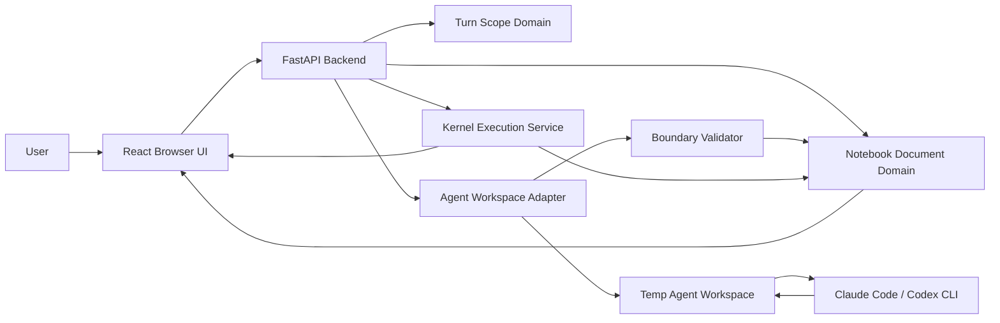

# Local Notebook Agent Editor Spec

## Status

Draft v1 product and architecture specification.

This document captures the confirmed design for a local notebook editor focused on
cell-scoped AI agent edits. It is intended to be completed before implementation.

## Understanding Summary

- Build a standalone local notebook editor served by a local backend with a browser UI.
- Support uploading, downloading, editing, and running `.ipynb` notebooks.
- Integrate external local CLI coding agents first, such as Claude Code or Codex.
- Let users grant per-turn edit permission to specific notebook cells.
- Let agents read the whole notebook and explicit context cells, but write only to cells in the current turn's editable set.
- Make scoped edit trust the primary v1 success criterion.
- Avoid collaboration, cloud/team workflows, dashboard/data-app features, plugin ecosystems, and formats beyond `.ipynb` in v1.

## Target User

The v1 user is a solo data scientist or ML engineer working locally with small or
medium Jupyter notebooks and AI coding agents.

## Goals

- Provide a local notebook-first editor with native AI scope controls.
- Make it obvious which cells the agent can edit in the current turn.
- Mechanically enforce the editable-cell boundary in the backend.
- Provide Cursor-style immediate application of valid changes with visible color-coded diffs.
- Provide whole-turn undo in chat and per-cell revert in the notebook UI.
- Run affected downstream notebook cells after valid edits and show results to both user and future agent context.
- Support upload/import and download/export file operations for `.ipynb`.

## Non-Goals

- No collaboration, cloud sync, comments, or team governance in v1.
- No rich data-app/dashboard builder features in v1.
- No plugin ecosystem in v1.
- No notebook formats beyond `.ipynb` in v1.
- No full OS sandboxing of external CLI agents in v1.
- No structural notebook edits by the agent in v1.
- No durable undo/audit history across app restart in v1.

## Architecture Overview

V1 uses a local FastAPI backend serving a React browser UI.

The system is divided into bounded contexts:

- Notebook Document
- Turn Scope
- Agent Workspace
- Boundary Validation
- Kernel Execution
- UI Session

The core architectural rule is:

> Agent integration must not own notebook mutation. It can produce candidate
> cell-source changes; the Notebook Document domain applies or rejects them.

## Architectural Invariants

These invariants are non-negotiable and should be enforced in code and tests:

- The live notebook document is mutated only by Notebook Document use cases.
- The external CLI agent never receives write access to the live notebook document.
- The backend never imports modified `notebook.ipynb` from the temp agent workspace.
- The backend reads candidate edits only from files listed in the frozen turn manifest.
- A candidate source change is valid only when its `cellId` is in the frozen editable set.
- Turn scope expires after the turn completes, fails, or is cancelled.
- Undo restores notebook document state, not kernel process state.
- UI state is advisory; backend validation is authoritative.
- Cell IDs are valid and unique before a notebook session becomes editable.
- At most one notebook-mutating operation owns the session mutation lease.
- Kernel results are committed only for the active execution attempt and the
  exact cell source revision that was executed.
- Approval and cancellation commands are correlated to immutable attempt IDs
  and are idempotent.

## High-Level Runtime Diagram



The most important dependency direction is from orchestration toward domain
services. The agent adapter, kernel runner, and UI should depend on notebook
domain interfaces rather than owning notebook mutation themselves.

## Bounded Contexts

### Notebook Document

Responsibilities:

- Load and parse `.ipynb` files.
- Validate basic notebook structure and format version before identity
  normalization, then run full nbformat validation afterward.
- Normalize missing, invalid, and duplicate standard nbformat cell IDs.
- Upload/import and download/export.
- Close/unload the active notebook without terminating the application.
- Track dirty state.
- Maintain a monotonic document revision and mutation ownership metadata.
- Store in-memory checkpoints.
- Apply validated source changes atomically.
- Restore notebook document state during undo.

Out of scope:

- Agent process orchestration.
- UI rendering.
- Kernel side-effect analysis.

Core use cases:

- `LoadNotebook`
- `NormalizeCellIds`
- `CreateNotebookCheckpoint`
- `ApplyValidatedCellSourceChanges`
- `RestoreNotebookCheckpoint`
- `ExportNotebook`
- `CloseNotebook`

Revision and mutation rules:

- Every source, output, execution-count, metadata-normalization, or checkpoint
  restoration mutation increments the document revision.
- Agent turns and manual execution acquire a session mutation lease before
  starting. Only the lease owner may commit mutations until it reaches a
  terminal state.
- While a mutation lease is active, imports, source edits, turn-scope changes,
  undo/revert, manual execution, close, and new agent turns fail with `409 Conflict`.
  Download may read a consistent snapshot.
- Each mutation records its primary owner (`manual`, an agent `turnId`, or a
  manual execution `attemptId`). Agent-triggered execution results retain their
  child attempt ID but use the parent `turnId` as mutation owner, so undo
  eligibility can be checked without relying on UI history.

### Turn Scope

Responsibilities:

- Track editable cells for the next agent request.
- Track read-only context cells for the next agent request.
- Expire scope after each terminal agent turn, including failure and cancellation.
- Preserve terminal turn scope and outcome in visible in-session history for audit/debugging.

Rules:

- Permissions are turn-level, not thread-level.
- A cell mentioned as editable in one turn is not editable in the next turn unless explicitly added again.
- Drag/drop into chat adds a cell to the editable set by default.
- Cell gutter controls expose both "Add as context" and "Add to edit".

Core use cases:

- `AddEditableCellToTurnScope`
- `AddContextCellToTurnScope`
- `FreezeTurnScope`
- `ClearTurnScope`
- `RecordTerminalTurnScope`

### Agent Workspace

Responsibilities:

- Create a fresh temporary workspace for each agent turn.
- Provide the full notebook as read-only context.
- Provide writable plain-source files only for editable cells.
- Provide a manifest mapping editable cells to files.
- Launch the configured local CLI agent.
- Collect candidate changes after the agent exits.
- Audit protected and writable workspace paths after the agent exits.
- Enforce CLI timeout, cancellation, and process-tree cleanup.

The agent workspace is disposable and should not be treated as source of truth.

Core use cases:

- `CreateAgentWorkspace`
- `WriteAgentInstructions`
- `LaunchCliAgent`
- `CollectEditableCellFileChanges`
- `DestroyAgentWorkspace`

Adapter contract:

- Each supported CLI adapter declares its exact command template, compatible
  CLI versions, edit/propose mode, terminal-tool denial mechanism, auxiliary
  files it may create, timeout behavior, and cancellation strategy.
- An adapter that cannot start non-interactively with terminal/tool execution
  denied is unsupported in v1 and must fail before the turn starts.
- This is a cooperative adapter restriction, not an OS security boundary. A
  compromised or non-conforming CLI process may still use its ambient OS
  permissions, as described in Security And Privacy Posture.

### Boundary Validation

Responsibilities:

- Compare candidate changes against the immutable turn scope.
- Reject invalid changes before they reach the live notebook state.
- Retry up to two times after boundary violations.
- Produce user-visible boundary violation errors when retries fail.

Core use cases:

- `ValidateCandidateChangeSet`
- `DetectBoundaryViolation`
- `BuildRetryInstruction`
- `CreateValidatedChangeSet`

### Kernel Execution

Responsibilities:

- Resolve and launch the notebook session's kernel through a `KernelProvider`
  for the bound `EnvironmentSpec`, rather than hardcoding a single environment.
- Run notebook cells through that kernel.
- After valid edits, execute code cells from the first edited cell onward.
- Skip Markdown cells.
- Detect risky cells before execution.
- Request approval for risky downstream cells.
- Stop execution if the user declines a risky cell.
- Store outputs/errors in the agent turn log for follow-up context.
- Support user-initiated run-cell and run-all operations.
- Interrupt or restart the active kernel.

Core use cases:

- `ListAvailableEnvironments`
- `ResolveKernelEnvironment`
- `StartKernelSession`
- `ClassifyRiskyCell`
- `ExecuteDownstreamCells`
- `RequestRiskyExecutionApproval`
- `CaptureExecutionResult`
- `ExecuteCell`
- `ExecuteAllCells`
- `InterruptKernel`
- `RestartKernel`

See `Kernel Environment` for the provider model. The current implementation
resolves to a single `local-interpreter` provider bound to the backend's own
Python environment; the abstraction exists so this becomes selectable and,
later, non-local without changing the execution, lease, or approval logic.

### UI Session

Responsibilities:

- Render notebook cells.
- Render hover/selection gutter controls.
- Render chat and turn-scope lists.
- Render color-coded diffs.
- Render whole-turn undo and per-cell revert actions.
- Render dirty state, upload/download controls, and execution status.

Core use cases:

- `RenderNotebookCells`
- `RenderCurrentTurnScope`
- `RenderAgentTurnHistory`
- `RenderScopedDiffs`
- `RenderInlineCellDiffDecorations`
- `RequestAgentTurn`
- `UndoAgentTurn`
- `RevertCellChange`
- `RunNotebookCell`
- `RunAllNotebookCells`
- `InterruptKernelExecution`
- `RestartKernelSession`

## Suggested Backend Module Boundaries

The backend should avoid generic folders such as `utils` or `helpers`. Use
domain-specific modules that match the bounded contexts:

```text
backend/
  app/
    api/
      notebook_routes.py
      turn_scope_routes.py
      agent_turn_routes.py
      execution_routes.py
    notebook_document/
      models.py
      repository.py
      nbformat_service.py
      mutation_coordinator.py
      checkpoint_service.py
      source_change_service.py
    turn_scope/
      models.py
      service.py
    agent_workspace/
      models.py
      workspace_builder.py
      adapter_registry.py
      cli_agent_runner.py
      change_collector.py
      workspace_auditor.py
    boundary_validation/
      models.py
      validator.py
      retry_policy.py
    kernel_execution/
      models.py
      kernel_session.py
      risky_cell_classifier.py
      downstream_runner.py
      execution_coordinator.py
    session_history/
      models.py
      service.py
```

The route layer should stay thin. It should parse requests, call use-case
services, and return response DTOs. Notebook mutation, agent orchestration, and
execution policy should not live in route handlers.

## Suggested Frontend Module Boundaries

```text
frontend/
  src/
    app/
      App.tsx
      routes.tsx
    notebook/
      NotebookView.tsx
      NotebookCell.tsx
      CellEditor.tsx
      CellGutterActions.tsx
      cellDiffModel.ts
    turnScope/
      TurnScopePanel.tsx
      turnScopeStore.ts
    agentChat/
      AgentChatPanel.tsx
      AgentTurnHistory.tsx
      AgentTurnControls.tsx
    execution/
      RiskyExecutionDialog.tsx
      ExecutionStatus.tsx
      KernelControls.tsx
    fileOperations/
      FileToolbar.tsx
      fileOperationsApi.ts
    api/
      client.ts
```

The frontend should keep permission state visible, but it should not be trusted
for enforcement. Every agent turn request must be validated by the backend using
the current server-side notebook state and frozen turn scope.

## Core Domain Models

These are conceptual models, not final class definitions:

```text
NotebookSession
  sessionId
  path?
  notebook
  revision
  dirty
  mutationLease?
  environmentRef?
  checkpoints[]
  turnHistory[]

EnvironmentSpec
  environmentId
  kind          # local-interpreter | container | remote-gateway
  identifier    # interpreter path, kernelspec name, image ref, or gateway URL
  displayName
  capabilities  # interrupt, restart, provisioning, isolation

NotebookCellRef
  cellId
  index
  cellType
  preview

TurnScope
  turnId
  notebookRevision
  editableCellIds[]
  contextCellIds[]
  prompt
  frozenAt

CandidateCellSourceChange
  cellId
  previousSource
  nextSource
  tempFilePath

ValidatedChangeSet
  turnId
  notebookRevision
  changes[]

ExecutionResult
  executionAttemptId
  cellId
  startingDocumentRevision
  sourceHash
  status
  outputs
  executionCount
  error?

PendingRiskyExecution
  executionAttemptId
  turnId
  cellId
  cellIndex
  expectedDocumentRevision
  expectedSourceHash
  preview
  reasons[]
  status

AgentTurn
  turnId
  baseRevision
  state
  activeExecutionAttemptId?
  createdAt
  completedAt?

MutationLease
  ownerType
  ownerId
  acquiredAt
```

Agent turn states are:

```text
created -> agent_running -> validating -> applying -> executing
executing -> awaiting_approval -> executing
created | agent_running | validating | applying | executing | awaiting_approval
  -> completed | validation_incomplete | failed | cancelled
```

Terminal transitions release the mutation lease, clear the frozen current-turn
scope, record history, and clean up the workspace. State transitions use
compare-and-set semantics so duplicate cancellation or approval requests do not
repeat side effects.

Modeling these concepts explicitly is important because the product's main
value is not generic chat. The value is controlled transformation of notebook
cell source under a precise permission model.

## Manual Notebook Editing

Users may edit notebook cells directly in the UI outside the agent flow.

Rules:

- Manual user edits are trusted edits to the live notebook session.
- Manual edits are not passed through the agent boundary validator.
- Manual edits update the notebook revision and dirty state.
- Manual edits require the current document revision and fail with
  `409 Conflict` while a mutation lease is active or if the supplied revision is
  stale.
- Agent boundary validation applies only to candidate changes produced by agent turns.

Manual execution:

- Users may explicitly run one code cell or all code cells, interrupt execution,
  and restart the kernel.
- A manual run acquires the same session mutation lease used by an agent turn.
- Clicking a manual run command is explicit authorization to execute the chosen
  cells, so the automatic risky-cell confirmation flow is not repeated.
- Each result is committed only if its execution attempt still owns the lease
  and the executed cell's source hash still matches.

## Permission Model

The core rule:

> A cell is writable only if its standard nbformat cell ID appears in the
> current turn's editable set.

Allowed in v1:

- Edit source of editable code cells.
- Edit source of editable Markdown cells.
- Update outputs and execution counts through kernel execution.

Not allowed in v1:

- Add cells.
- Delete cells.
- Reorder cells.
- Change cell type.
- Change notebook metadata.
- Change cell metadata.
- Directly write outputs.
- Persist edit permission across turns.

Read permissions:

- The external agent may read the full notebook.
- The external agent may read cells explicitly added as context.
- V1 assumes the local CLI agent environment is trusted; the app does not try to enforce full OS read isolation.

Write enforcement:

- The UI communicates scope, but the backend enforces scope.
- The live `.ipynb` document is never edited directly by the CLI agent.
- Only validated source changes from editable temp files can enter the notebook.

## Cell Identity

Cell boundaries use standard nbformat cell IDs.

Rules:

- Normalize identity before exposing an imported notebook as a session.
- Preserve existing IDs only when they are valid and unique.
- Generate replacement standard IDs for missing, invalid, or duplicate IDs. For
  duplicates, preserve the first valid occurrence and replace later occurrences.
- Validate the normalized notebook again before accepting the import.
- Treat ID normalization as an in-memory notebook mutation: increment revision,
  mark dirty, and include the IDs in the downloaded notebook.
- Include generated IDs in the downloaded notebook.
- Do not rely on cell indexes for permission boundaries.
- Show cell index/order in UI for readability, but use ID for validation.

## Agent Workspace Protocol

For each agent turn, the backend creates a fresh temporary workspace:

```text
turn-workspace/
  notebook.ipynb
  AGENT_CELL_MANIFEST.json
  INSTRUCTIONS.md
  editable/
    cell_<cell-id>.py
    cell_<cell-id>.md
```

`notebook.ipynb`:

- Contains the full original notebook JSON.
- Is provided for read-only context.
- Is not imported back as an edited artifact.
- Should be marked read-only at the filesystem level where possible.
- Must still be treated as untrusted even if filesystem read-only enforcement is unavailable.

`AGENT_CELL_MANIFEST.json`:

```json
{
  "notebookPath": "notebook.ipynb",
  "editableCells": [
    {
      "cellId": "abc123",
      "index": 4,
      "type": "code",
      "path": "editable/cell_abc123.py"
    }
  ],
  "contextCells": [
    {
      "cellId": "def456",
      "index": 2,
      "type": "markdown"
    }
  ]
}
```

The file is an agent-readable copy. The backend retains the authoritative
manifest as an immutable in-memory value and never trusts a manifest read back
from the workspace. Explicit context cells are highlighted by ID and preview in
`INSTRUCTIONS.md`; they do not grant additional read access because the full
notebook is already readable.

Editable cell files:

- Are plain source only.
- Code cells use `.py`.
- Markdown cells use `.md`.
- File content maps exactly to `cell.source`.
- No metadata, outputs, execution counts, or cell type information appears in the editable file content.
- The collector opens each path without following symlinks and accepts only a
  regular UTF-8 file contained directly under `editable/`.
- Each file has a configurable source-size limit, and the aggregate candidate
  set may not exceed the notebook upload limit. Missing, non-regular,
  invalid-encoding, oversized, or path-escaping files reject the whole candidate
  set.

`INSTRUCTIONS.md`:

- Contains the user prompt.
- Names the editable files.
- States that only listed editable files may be changed.
- States that notebook structure, metadata, outputs, and cell types are out of scope.
- States that the agent must not run shell commands in v1.

### CLI Agent Execution Policy

V1 should launch external CLI agents in the safest available edit/propose mode.

Rules:

- The CLI agent may read the temp workspace.
- The CLI agent may edit files listed in `editableCells`.
- The app configures the supported adapter so terminal/tool execution requests
  are denied and never approved by the app in v1.
- If the adapter reports a terminal request or loses the configured denial
  capability, the app aborts the turn.
- Notebook execution is owned by the app after validated changes are applied.
- Shell command output from the CLI agent should not be part of the v1 workflow.

This separates agent editing from notebook validation. The agent proposes source
changes; the app applies valid changes and runs notebook cells under the risky
execution policy.

## Agent Turn Flow

1. User adds editable/context cells for the next turn.
2. User sends prompt.
3. Backend validates the request revision and atomically acquires the mutation
   lease, freezes the turn scope, and checkpoints the full notebook document.
4. Backend records the frozen revision as the turn's `baseRevision`.
5. Backend creates the temp agent workspace.
6. Backend launches the configured CLI agent.
7. Backend reads only files listed in `editableCells`.
8. Backend builds a candidate source-change set.
9. Backend validates the candidate set.
10. On boundary violation, backend destroys the workspace and retries up to two
    times from a fresh workspace built from the same frozen notebook revision,
    adding only a corrective violation summary to the instructions.
11. If valid, backend applies all source changes atomically.
12. UI shows color-coded diffs per changed cell.
13. Backend runs downstream code cells from the first edited cell onward.
14. Outputs/errors are shown in the notebook UI and stored in the turn log.
15. Backend enters a terminal turn state, releases the mutation lease, destroys
    the workspace, and clears the editable/context scope lists.

## Validation And Apply Flow

Candidate changes use this shape:

```json
{
  "cellId": "abc123",
  "previousSource": "...",
  "nextSource": "..."
}
```

`previousSource` is always copied by the backend from the frozen notebook
revision; it is never supplied by or read from the agent workspace. A file whose
content is unchanged is omitted from the candidate set. If the candidate set is
empty, the turn completes as a no-op without downstream execution.

Reject the whole change set if:

- The authoritative manifest references a missing, invalid, or non-unique cell ID.
- Notebook revision changed unexpectedly during the turn.
- Temp file extension does not match cell type.
- An editable path fails the regular-file, containment, encoding, or size checks.
- Workspace audit detects a modification to `notebook.ipynb`, the readable
  manifest copy, `INSTRUCTIONS.md`, or another protected path.
- Workspace audit detects an undeclared created or modified path other than an
  adapter-specific auxiliary path declared by the adapter contract.

Structure, cell type, metadata, outputs, and execution counts are not candidate
fields in this protocol and therefore cannot be applied. Attempts to change
their workspace representations are detected by the protected-path audit. The
backend may report those attempts, but it still reads candidate source only from
the authoritative manifest's editable files.

Apply semantics:

- Apply is atomic.
- Either all validated scoped source changes apply, or none apply.
- Boundary validation happens server-side.
- Automatic retries are for boundary violations only, not for poor code quality.
- A retry is allowed only while the current revision still equals the frozen
  base revision. Revision conflict, cancellation, timeout, or adapter failure is
  terminal and is never retried automatically.

## Cancellation, Timeouts, And Cleanup

- Cancellation is accepted for any non-terminal agent turn or execution
  attempt and is idempotent.
- Before source apply, cancellation terminates the CLI process tree and leaves
  the notebook unchanged.
- After source apply, cancellation interrupts active kernel execution, preserves
  the applied sources and already committed outputs, marks the turn cancelled,
  and leaves checkpoint undo available if its lineage checks still pass.
- CLI and cell-execution timeouts are configurable. V1 defaults are 10 minutes
  per CLI attempt and 5 minutes per cell; a timeout follows the same cleanup
  path as cancellation but records a `timed_out` failure reason.
- CLI processes run in a dedicated process group. Cleanup requests graceful
  termination, waits a short configurable grace period, then force-terminates
  the remaining process group.
- Kernel interrupt has a bounded wait. If the kernel does not become idle, the
  UI offers restart; restart clears kernel memory but does not alter the notebook
  document.
- Workspace destruction and mutation-lease release run in a `finally` path for
  success, failure, timeout, and cancellation. Startup recovery clears any
  orphaned in-memory lease because v1 has no durable active operations.

## Execution Model

After valid edits:

- Determine the earliest notebook index among edited **code** cells.
- Execute code cells from that index onward.
- Skip Markdown cells.
- A turn that changes only Markdown (or other non-code) cells performs no
  downstream execution and completes: there is no code to re-validate, so a
  title or prose edit must not run the notebook. No execution operation is
  created for such a turn. Edited Markdown cells also do not lower the start
  index of a turn that does edit code; execution begins at the first edited
  code cell.
- Create a unique execution attempt for each cell and capture its starting
  document revision and source hash.
- Store outputs and execution counts produced by the kernel.
- Show outputs/errors to the user.
- Include outputs/errors in the in-session agent turn log.
- Before committing a result, verify that the turn owns the mutation lease, the
  attempt is still active, and the cell source hash matches. Otherwise discard
  the result, interrupt remaining execution, and mark the turn failed with a
  stale-result error.
- Stop downstream execution on the first cell error and mark the turn failed;
  preserve the error output and all earlier committed results. Manual run-all
  follows the same stop-on-error rule in v1.

Risky downstream cells:

- If a downstream cell is classified as risky, ask the user before running it.
- If the user approves, run it and continue.
- If the user declines, stop there.
- Mark validation as incomplete, not failed.

Initial risky-cell categories:

- Shell commands: `!`, `%sh`, `subprocess`, `os.system`.
- Package/environment changes: `%pip`, `%conda`, `pip install`.
- File writes/deletes: write-mode `open`, `Path.write_*`, `shutil`, `rm`.
- Network calls: `requests`, `httpx`, `urllib`, cloud SDKs.
- Database writes: `INSERT`, `UPDATE`, `DELETE`, `DROP`, `ALTER`.
- Secret/environment access: `os.environ`, `.env`, credential files.

Risky detection is expected to be conservative and imperfect in v1.

### Risky-Cell Classifier Design

The classifier should follow the same broad safety model used by coding-agent
tools: reads are usually low risk; writes, deletes, terminal commands, network
operations, credential access, and package/environment changes are sensitive.

V1 should implement a conservative static classifier before running each
downstream code cell. It should return:

```text
RiskClassification
  level: safe | confirm
  reasons[]
  matchedPatterns[]
```

There is no `deny` level in v1. The product posture is local-trusted, so risky
cells require confirmation rather than being permanently blocked.

Classifier pipeline:

1. Inspect Jupyter magics and shell escapes at the source-text level.
2. Parse Python cells with `ast` when possible.
3. If AST parsing fails, fall back to text-pattern classification.
4. Produce a short user-facing reason for each risky match.
5. Ask once per risky cell execution attempt.

Confirm by default:

- Any shell escape starting with `!`.
- Shell magics such as `%sh`, `%%sh`, `%%bash`, `%%script`.
- Package or environment mutation such as `%pip`, `%conda`, `pip install`, `conda install`, `uv pip install`.
- Filesystem writes or deletes such as `open(..., "w")`, `open(..., "a")`, `Path.write_text`, `Path.write_bytes`, `shutil.rmtree`, `os.remove`, `os.unlink`, `rm`, `mv`, `cp` when executed through shell.
- Process execution such as `subprocess.run`, `subprocess.Popen`, `os.system`, `os.exec*`.
- Network clients such as `requests`, `httpx`, `urllib.request`, `aiohttp`, `socket`, cloud SDK clients.
- Database write statements containing `INSERT`, `UPDATE`, `DELETE`, `DROP`, `ALTER`, `TRUNCATE`, `CREATE`, or `MERGE`.
- Secret or credential access such as `os.environ`, `.env`, `.pem`, `.key`, `.ssh`, credential files, or known cloud credential paths.
- Notebook/kernel control commands such as restart/shutdown calls if detected.

Safe by default:

- Pure Python computation without matched side-effect APIs.
- Imports by themselves, except known network/cloud/database SDK imports should add a low-confidence reason only when followed by client calls.
- Reading local files for display or analysis, unless the path appears secret or credential-related.
- Plotting, dataframe transformations, model evaluation, and Markdown rendering.

Approval UI:

- Show a permission notification in the chat window.
- Include the cell index, cell preview, and matched reasons.
- Offer `Run this cell`, `Skip and stop validation`, and `Cancel agent turn`.
- While the notification is pending, downstream execution is suspended.
- Approval, skip, and cancellation requests include the execution attempt ID,
  turn ID, cell ID, and expected document revision.
- The backend accepts a decision only for the matching pending attempt. Repeated
  identical decisions return its current state; conflicting or stale decisions
  return `409 Conflict`.
- If approved, resume execution from the risky cell.
- If skipped, downstream execution stops and validation is marked incomplete.
- If cancelled, abort the remaining execution and mark the turn cancelled.
- The user's approval is for this execution attempt only in v1.

This classifier is a guardrail, not a sandbox. It reduces accidental side
effects during downstream validation, but it cannot prove a cell is safe.

## Kernel Environment

The environment that executes a notebook must be a first-class, per-notebook
binding, not an accident of how the backend process was launched. Today the
kernel is started with a hardcoded `KernelManager(kernel_name="python3")`, which
resolves to the backend's own interpreter. That interpreter carries only the
application's dependencies, so a notebook that imports libraries the app does not
ship (for example `pandas`) fails with `ModuleNotFoundError` on any run — manual,
run-all, or agent downstream. This is an environment gap, not an execution bug.

### Provider Model

Kernel Execution owns a `KernelProvider` abstraction that decouples *which
environment runs the code* from *how execution is driven*. This mirrors the
Agent Workspace CLI adapter registry: pluggable, capability-checked, fail-closed.

- `KernelProvider.launch(EnvironmentSpec) -> KernelHandle`, where `KernelHandle`
  exposes the same interface the current kernel session already provides
  (`execute`, `interrupt`, `restart`, execution correlation, `shutdown`).
- Because the rest of Kernel Execution already talks to a kernel through that
  interface, provider selection changes only *where* the kernel process lives.
  Execution attempts, source-hash checks, the single mutation lease, stale-result
  rejection, and risky-cell approval are all unchanged.

Provider kinds:

- `local-interpreter`: launch ipykernel via a chosen interpreter path or a
  registered Jupyter kernelspec (other venvs, conda environments). Local, but
  selectable rather than fixed to the app's own environment.
- `container`: launch the kernel inside a per-notebook container image. Gives
  dependency isolation and OS-level execution isolation together.
- `remote-gateway`: attach to a kernel through a Jupyter Kernel Gateway /
  Enterprise Gateway over HTTP/WebSocket. A standard protocol for off-box
  kernels, so the transport is not reinvented.

The `container` and `remote-gateway` providers are the answer to "not just
local." They are also where the sandboxing this spec otherwise defers naturally
belongs.

### Environment Resolution

A resolved `EnvironmentSpec` is bound to the `NotebookSession` as
`environmentRef`. Resolution order, validated and fail-closed:

1. Explicit user selection (an environment picker in the UI).
2. The notebook's own `metadata.kernelspec` as a default hint.
3. A configured default environment.

The selection is a hint that must be validated, exactly as cell-ID normalization
and CLI adapter capability are validated. If the chosen environment cannot be
launched or fails its health check, the session reports a clear error rather than
silently falling back to a different environment.

### Selection Versus Provisioning

Two related but distinct features hide inside "per-notebook environment":

- Selecting an existing environment that already contains the notebook's
  dependencies. Minimal; the user manages dependencies.
- Provisioning or building an environment from declared dependencies
  (`requirements.txt`, `environment.yml`, inline `%pip`), cached per notebook.
  More powerful, and much more complex (build time, caching, reproducibility).

Selection is the foundation and ships first; provisioning is deferred.

### Lifecycle And Correctness

- Changing a session's environment is a kernel restart into the new environment.
  It clears kernel memory like any restart, is lease-guarded, and is deliberate.
- Launching a container or remote kernel can exceed the kernel-startup timeout.
  Model a separate, longer, cancelable provisioning phase so a slow or failing
  launch never hangs the sole session's mutation lease.
- Providers must guarantee teardown (container stop/remove, remote disconnect) on
  close, replacement, and shutdown, extending the existing `finally`-based
  process-group cleanup. This is the riskiest surface for non-local providers.
- The current local kernel uses unencrypted loopback TCP. A `remote-gateway`
  provider requires the authentication and transport-security design this spec
  currently defers before it binds beyond loopback.

### Phased Path

1. Extract `KernelProvider` / `EnvironmentSpec`; reimplement today's behavior as
   `local-interpreter` bound to the backend interpreter, with a fail-closed
   health check. No behavior change.
2. Local environment selection: enumerate available interpreters/kernelspecs,
   expose a picker, bind per session, default from `metadata.kernelspec`. This is
   the step that resolves the missing-dependency failure.
3. Container provider: per-notebook isolated image, provisioning phase, and
   guaranteed teardown.
4. Remote gateway provider, gated on the deferred transport auth/TLS design.

## Undo And Checkpoints

Before every agent turn, store a full in-memory notebook document checkpoint.

Whole-turn undo:

- Triggered from the chat window.
- Restores the pre-turn notebook document state.
- Restores sources, outputs, execution counts, and visible diff state.
- Does not restore live kernel memory state.
- Is available only for the most recent agent turn that applied changes when
  every mutation since its checkpoint is owned by that turn. Any later manual
  edit, import, revert, manual execution, or agent turn makes full-checkpoint
  undo ineligible, regardless of whether the applied turn completed, failed,
  timed out, or was cancelled during execution.
- Requires the current document revision in the request and fails with
  `409 Conflict` if the revision or eligibility check no longer matches.
- Creates a new document revision rather than moving the revision counter
  backward.

Per-cell revert:

- Triggered from a changed cell.
- Reverts that cell's source to the pre-turn source.
- Should make clear that kernel memory state is not restored.
- Is allowed only when the cell's current source hash equals the `nextSource`
  hash recorded for that turn and no mutation lease is active.
- Requires the current document revision and creates a new manual mutation. It
  never rewinds unrelated cells or later outputs.

Persistence:

- Checkpoints are in-memory only.
- Undo history does not survive app restart in v1.
- In-session turn history is enough for v1.

## UI Behavior

Notebook surface:

- Render cells in notebook order.
- Show gutter controls only on hover or selection.
- Controls:
  - Add as context.
  - Add to edit.
- Support drag/drop from a cell into the chat panel.
- Drag/drop defaults to editable.
- Provide run-cell controls for code cells and a run-all command.
- Provide kernel status, interrupt, and restart controls.
- Disable mutating controls while another operation owns the mutation lease,
  while keeping notebook download available.

Chat panel:

- Show two compact current-turn lists:
  - Editable Cells.
  - Context Cells.
- Do not duplicate complete cell contents in chat.
- Each list item should show:
  - notebook index/order,
  - cell type,
  - short first line/title,
  - stable color,
  - cell ID on hover or details.
- Clicking a list item focuses the cell in the notebook.
- After any terminal turn state, clear both lists.
- Preserve terminal turn scope and outcome in chat history.

Diff display:

- Apply valid changes immediately.
- Show color-coded changed regions in each edited cell.
- Show Cursor-style inline diff decorations inside the CodeMirror editor of each
  changed cell (added lines highlighted, removed lines shown as inline markers),
  in addition to the color-coded diff panel below the cell.
- Keep the inline decorations and the diff panel complementary; the panel still
  covers Markdown-preview cells and bounded rendering of very large diffs.
- Provide per-cell revert controls.
- Provide whole-turn undo in the chat turn.

File controls:

- Upload/import `.ipynb`.
- Download current notebook as `.ipynb`.
- Track dirty state.

## API Surface Draft

This is a conceptual API surface, not a final implementation contract.

- `POST /notebooks/upload`
- `GET /notebooks/current`
- `DELETE /notebooks/current`
- `GET /notebooks/download`
- `POST /cells/{cellId}/source`
- `POST /turn-scope/editable-cells`
- `POST /turn-scope/context-cells`
- `DELETE /turn-scope`
- `POST /agent-turns`
- `POST /agent-turns/{turnId}/cancel`
- `POST /agent-turns/{turnId}/undo`
- `POST /agent-turns/{turnId}/cells/{cellId}/revert`
- `POST /execution/cells/{cellId}/run`
- `POST /execution/run-all`
- `POST /execution/{executionAttemptId}/approve`
- `POST /execution/{executionAttemptId}/skip`
- `POST /execution/{executionAttemptId}/cancel`
- `POST /kernel/{kernelSessionId}/interrupt`
- `POST /kernel/{kernelSessionId}/restart`
- `GET /kernel/status`
- `GET /environments`
- `POST /environments/select`
- `GET /events`

`GET /environments` lists the environments the resolved providers can launch.
`POST /environments/select` binds an `environmentId` to the session and restarts
the kernel into it under session/revision preconditions; an unlaunchable or
failed environment returns a structured error and leaves the prior binding.

All mutating requests include `sessionId` and `expectedDocumentRevision` either
in the body or an `If-Match`-style header. Turn and execution responses expose
their state and current document revision. Creating an agent turn or execution
returns an operation resource immediately; the UI receives state changes through
server-sent events in v1, with polling as a fallback.

The first upload creates a session and therefore omits those preconditions;
replacing an active notebook requires both. Kernel interrupt/restart requests
also include the active `executionAttemptId` when the kernel is busy and use the
path's `kernelSessionId` as a compare-and-set precondition, preventing a stale
browser command from affecting a newer kernel or execution.

Closing the active notebook requires its `sessionId` and
`expectedDocumentRevision`. A successful close atomically unloads the in-memory
document, clears turn scope and the active event journal, closes old-session SSE
streams, and replaces/shuts down kernel state. It also purges retained agent
turns (including source changes and undo checkpoints), execution operations and
attempts, and terminal turn-scope history so old resource IDs become
inaccessible. Listener cleanup failures do not roll back the committed close;
the response includes cleanup diagnostics.
The next upload is a new first upload and omits replacement preconditions.
Uploading a replacement notebook performs the same purge of outgoing-session
turn, checkpoint, source-change, execution, attempt, and terminal-scope records;
old resource IDs cannot be fetched after either replacement or close.

## Stack

Backend:

- Python.
- FastAPI.
- `nbformat` for notebook parsing and validation.
- Jupyter kernel libraries for execution.
- Process orchestration for CLI agents.

Frontend:

- React.
- Custom notebook shell.
- CodeMirror 6 for cell editors in v1.

Editor choice:

- CodeMirror 6 is the v1 default because it is lighter than Monaco, highly customizable, and a good fit for notebook-style per-cell editors.
- Monaco can be revisited later if VS Code-like language services become more important than notebook interaction control.

## Error Handling

Boundary violation:

- Reject whole candidate change set.
- Retry up to two times.
- If still invalid, show attempted out-of-scope behavior and stop.

Mutation conflict:

- Return `409 Conflict` with the current document revision, active operation
  type, and operation ID.
- Do not queue a second mutating operation implicitly.
- Refresh the UI and require the user to retry the action explicitly.

Agent failure:

- Preserve notebook checkpoint.
- Show CLI exit status and useful stderr/stdout summary.
- If the CLI or validation fails before apply, do not mutate notebook. Failures
  after apply preserve applied sources and already committed execution results.

Notebook changed during turn:

- Reject candidate changes if notebook revision no longer matches.
- Ask user to retry with current notebook state.

Stale execution result or decision:

- Discard a kernel result that does not match the active attempt, lease owner,
  expected revision lineage, and source hash.
- Reject stale or conflicting approval/cancellation decisions with
  `409 Conflict`; identical repeated decisions are idempotent.

Execution declined:

- Stop at declined risky cell.
- Mark validation incomplete.
- Preserve already-run outputs/errors.

Kernel failure:

- Show error output in cell.
- Store error in turn log.
- Do not automatically ask agent to iterate in v1.

Cancellation or timeout:

- Follow the process-tree or kernel interruption and cleanup rules above.
- Before apply, leave the notebook unchanged. After apply, preserve applied
  sources and committed results and expose eligible checkpoint undo.

Download failure:

- Keep notebook dirty.
- Show the failed export/download action.
- Preserve in-memory document state.

## Reliability And Performance Targets

V1 targets:

- Up to roughly 100 notebook cells.
- Up to roughly 5 MB `.ipynb` files.
- Single local user.
- One active notebook session in v1.
- One active notebook-mutating operation at a time.
- Cancellation acknowledgement within 1 second, excluding external process or
  kernel shutdown time; forced CLI cleanup begins after the configured grace
  period.
- No kernel output commit after its attempt loses the mutation lease or its
  source hash changes.

## Security And Privacy Posture

V1 is local-trusted for CLI agents.

The app guarantees:

- Only validated scoped source changes are written back to the live notebook.
- Agent-created temp workspace changes outside editable cell files are ignored for notebook mutation.
- Notebook write boundaries are enforced by the backend.
- The app invokes only adapters that pass the v1 capability check and does not
  approve terminal/tool requests from those adapters.

The app does not guarantee in v1:

- The external CLI agent cannot read other local files.
- The external CLI agent cannot access the network.
- The external CLI agent cannot execute subprocesses using its own permissions.

Adapter tool denial is defense in depth, not a sandbox guarantee. Execution risk
from notebook cells is handled separately through conservative risky-cell
approval for automatically triggered downstream execution.

## External Agent Permission Research Notes

The risky-cell model follows common patterns from current coding-agent tools:

- Claude Code separates read-only tools, Bash commands, and file modification, with prompts and allow/ask/deny rules.
- Codex CLI exposes approval modes for edits and command execution, including sandbox-aware approval policies.
- Zed Agent supports tool permission rules for terminal, edit, write, delete, move, copy, fetch, and other tools.
- Cursor CLI asks for command approval before terminal execution and supports file/context selection.

The common lesson for this product is that terminal execution, writes/deletes,
network access, and credential access deserve explicit confirmation, while the
notebook-specific write boundary should still be enforced independently by the
backend validator.

## Risks And Mitigations

Risk: CLI agents are optimized for file-level edits, not cell-level edits.

Mitigation: Use plain editable cell files and import only those files back into the notebook.

Risk: Raw `.ipynb` JSON is noisy for agents.

Mitigation: Start with full JSON for fidelity. Consider adding a Markdown-like readable export later if needed.

Risk: Risky-cell detection will miss side effects.

Mitigation: Document this limitation and keep detection conservative.

Risk: Running downstream cells can be slow or destructive.

Mitigation: Require approval for risky cells and stop if declined.

Risk: Undo does not restore live kernel memory state.

Mitigation: Restore notebook document state only and expose this clearly in UI.

Risk: Cell IDs may be missing in older notebooks.

Mitigation: Normalize missing, invalid, and duplicate IDs before the session is
editable, revalidate, and include replacements in exported notebooks.

Risk: Late kernel results or stale browser commands mutate a newer document.

Mitigation: Serialize mutation with a lease and validate attempt ID, revision
lineage, and source hash on every result or decision commit.

Risk: Undoing an older turn overwrites later work.

Mitigation: Permit full-checkpoint undo only for the latest applied turn with an
unbroken ownership lineage; guard per-cell revert by current source hash.

Risk: External CLI or kernel processes hang or outlive cancellation.

Mitigation: Use bounded timeouts, process groups, escalation to forced cleanup,
kernel interrupt/restart, and `finally`-based lease/workspace cleanup.

## Decision Log

### Product Shape

- Decision: Build a standalone local editor first.
- Alternatives: JupyterLab extension, VS Code/Cursor extension.
- Rationale: Standalone editor gives full control over notebook-native UI and permission boundaries.

### Delivery Architecture

- Decision: Use a local backend serving a browser UI.
- Alternatives: Desktop app first, frontend/backend desktop app shell.
- Rationale: Fastest v1 path; can later be wrapped in a desktop shell.

### Backend And Frontend Stack

- Decision: Python FastAPI backend and React frontend.
- Alternatives: Node/TypeScript backend, server-rendered frontend.
- Rationale: Python fits nbformat and Jupyter kernels; React fits custom notebook UI.

### Agent Integration

- Decision: Integrate external local CLI agents first.
- Alternatives: Direct model API integration.
- Rationale: Leverages Claude Code/Codex workflows and avoids building a full custom agent loop in v1.

### CLI Invocation

- Decision: Use the same general posture as Zed external agents: invoke Claude Code/Codex as local external agents from the generated turn workspace, letting those tools own their authentication and native behavior.
- Alternatives: Reimplement provider-specific model/tool protocols directly.
- Rationale: Keeps v1 focused on notebook scope enforcement rather than custom agent runtime design.

### CLI Adapter Capability

- Decision: Enable only version-tested adapters that can run non-interactively
  with terminal/tool requests denied; treat this as cooperative configuration,
  not OS isolation.
- Alternatives: Run any detected CLI; claim subprocess denial as a security boundary.
- Rationale: Fails closed for the supported workflow without overstating what a
  local child process can be prevented from doing without sandboxing.

### Agent Workspace

- Decision: Use a hybrid temp workspace.
- Alternatives: Let agent edit `.ipynb` directly; build direct API agent protocol.
- Rationale: Gives agents file-level edit ergonomics while preserving backend-enforced cell boundaries.

### Write Permissions

- Decision: Only current-turn editable cell source can be changed.
- Alternatives: Single editable cell only; full cell object edits; structural edits.
- Rationale: Best v1 trust boundary and easiest to validate.

### Context Permissions

- Decision: Agent may read the whole notebook and explicit context cells.
- Alternatives: Block read access to non-context cells.
- Rationale: User wants flexible read access; primary risk being solved is unintended writes.

### Turn Scope

- Decision: Edit permissions expire after every agent turn.
- Alternatives: Thread-level persistent permissions.
- Rationale: Prevents stale permission assumptions and makes each turn explicit.

### Boundary Violation Handling

- Decision: Reject whole change set and retry up to two times.
- Alternatives: Apply valid subset; no retry.
- Rationale: Atomic reject/retry is simpler and avoids incomplete partial edits.

### Execution

- Decision: After valid edits, run code cells from the first edited **code**
  cell onward. A turn that edits only Markdown/non-code cells runs no downstream
  execution and completes.
- Alternatives: Run only changed cells; run all editable cells; run whole
  notebook; start downstream from the first edited cell of any type.
- Rationale: Downstream code cells are most likely affected and provide useful
  validation without always running the entire notebook. Markdown edits cannot
  affect execution, so triggering a full downstream run from a title or prose
  edit only surfaces unrelated runtime errors (for example a missing dependency)
  as if the edit itself failed.

### Manual Execution

- Decision: Support run-cell, run-all, interrupt, restart, and kernel status in
  v1. A direct user run action authorizes the selected execution without the
  automatic downstream risky-cell prompt.
- Alternatives: Automatic post-agent execution only; confirm manual runs again.
- Rationale: Running notebooks is a stated editor requirement, and the user's
  explicit run command is already an execution decision.

### Risky Execution

- Decision: Ask before risky downstream cells; stop if declined.
- Alternatives: Free local execution; ask before every non-target cell.
- Rationale: Balances productivity and side-effect safety.

### Risky-Cell Classification

- Decision: Use conservative static classification with `safe` and `confirm` levels.
- Alternatives: No classification; full sandboxing; ask before every downstream cell.
- Rationale: Matches common coding-agent permission patterns while keeping v1 local and simple.

### Undo

- Decision: Store a full in-memory checkpoint before each agent turn, but allow
  checkpoint restoration only for the latest applied turn with an unbroken
  mutation-ownership lineage. Guard per-cell revert by source hash.
- Alternatives: Unrestricted historical checkpoint restoration; per-cell only undo; durable history.
- Rationale: Preserves whole-turn and per-cell recovery without overwriting later work.

### Cell Identity

- Decision: Use standard nbformat cell IDs and normalize missing, invalid, and
  duplicate IDs before the notebook becomes editable.
- Alternatives: Use cell indexes; custom metadata IDs.
- Rationale: Standard unique IDs avoid custom metadata and are required for an
  unambiguous permission boundary.

### Mutation Concurrency

- Decision: Serialize agent turns and manual execution with one session mutation
  lease; guard every mutation with document revision, attempt ID, and source hash
  where applicable.
- Alternatives: Allow concurrent editing and reconcile late results; rely only on frontend disabling.
- Rationale: V1 has one local session, so serialization is the simplest way to
  prevent stale output, approval, and undo mutations.

### Cancellation And Timeouts

- Decision: Support idempotent cancellation in every non-terminal state, bounded
  CLI and cell timeouts, process-group cleanup, and kernel interrupt/restart.
- Alternatives: Wait indefinitely; cancel only at risky-cell prompts.
- Rationale: A hung child process must not permanently hold the sole session's mutation lease.

### Active Notebook Sessions

- Decision: Support one active notebook session in v1.
- Alternatives: Multiple notebook tabs/sessions.
- Rationale: Keeps session state, kernel lifecycle, checkpointing, and turn scope simpler.

### Kernel Environment

- Decision: Make the execution environment a per-notebook binding resolved
  through a pluggable, capability-checked `KernelProvider`, instead of hardcoding
  the backend's own interpreter. Ship `local-interpreter` selection first;
  design `container` and `remote-gateway` providers for non-local and isolated
  execution; defer dependency provisioning.
- Alternatives: Keep the single hardcoded local kernel and tell users to install
  dependencies into the app's environment; build a bespoke remote execution
  transport instead of reusing a kernel gateway; provision environments from
  notebook dependencies before shipping selection.
- Rationale: A notebook's environment should not be an accident of how the
  backend was launched; that is what produces missing-dependency failures. A
  provider abstraction isolates the change to *where* the kernel runs, preserving
  the execution, lease, source-hash, and approval logic, and gives a clean path
  to isolated and off-box execution — including the sandboxing and transport
  security this spec otherwise defers.

### Notebook Close

- Decision: Allow the user to close the active notebook with session/revision
  preconditions while keeping the local application running.
- Alternatives: Require application restart; model close as an empty replacement notebook.
- Rationale: Explicit unload semantics clear notebook-scoped state and kernel
  resources without inventing a synthetic document or weakening stale-client checks.

### File Operations

- Decision: Use upload/import and download/export in v1.
- Alternatives: Backend local file browser/path workflow; native OS file picker.
- Rationale: Browser upload/download is enough for the v1 local web app and avoids OS integration complexity.

### Agent Progress Output

- Decision: Show only final agent output/result plus any final comments emitted by the CLI.
- Alternatives: Stream all CLI progress and tool output live.
- Rationale: Simpler UI and avoids overfitting to provider-specific streaming formats.

### Inline Diff Decoration

- Decision: Show Cursor-style inline added/removed decorations inside the
  CodeMirror editor, complementing (not replacing) the separate color-coded diff
  panel below each changed cell.
- Alternatives: Only the separate diff panel; replace the panel entirely with
  inline decorations; a full side-by-side two-pane diff.
- Rationale: Inline decorations put the change where the user reads/edits the
  code (Cursor-style), while the separate panel still serves Markdown-preview
  cells and bounded rendering of very large diffs; keeping both avoids losing the
  panel's coverage.

## Open Follow-Up Decisions

- Whether to add a readable Markdown-like notebook export alongside raw `.ipynb` context if agents struggle with notebook JSON.
- Whether to add durable turn history or sidecar audit logs after v1.
- Whether to support multiple notebook tabs after v1.
- How far to take per-notebook environments beyond local selection: the
  `container` and `remote-gateway` providers in `Kernel Environment` are the
  chosen direction for isolation, non-local execution, and the deferred process
  sandboxing, but their rollout order and the dependency-provisioning feature are
  still open.

Concrete CLI command templates and supported version ranges are adapter
implementation data, not an open product decision. An adapter must ship with
capability tests before it can be enabled.

## Implementation Handoff Outline

Implementation should start only after this spec is accepted.

Suggested phases:

1. Create FastAPI/React project skeleton.
2. Implement notebook upload/download, ID normalization, document revisions,
   and the mutation coordinator.
3. Implement custom notebook cell rendering and source editing.
4. Implement turn-scope UI and backend state.
5. Implement temp agent workspace generation, protected-path audit, and safe
   candidate collection.
6. Implement and capability-test one versioned CLI agent adapter, including
   timeout, cancellation, and process-tree cleanup.
7. Implement validation/apply pipeline.
8. Implement diff display and revision/lineage-guarded undo/revert.
9. Implement manual and downstream Jupyter execution, correlated risky-cell
   approval, kernel controls, and stale-result rejection.
10. Add contract and integration tests for notebook mutation boundaries,
    duplicate/missing/invalid IDs, workspace path attacks, retries, stale
    revisions, concurrent commands, late kernel results, stale or duplicate
    approvals, cancellation in every state, timeout cleanup, and undo/revert
    lineage.
